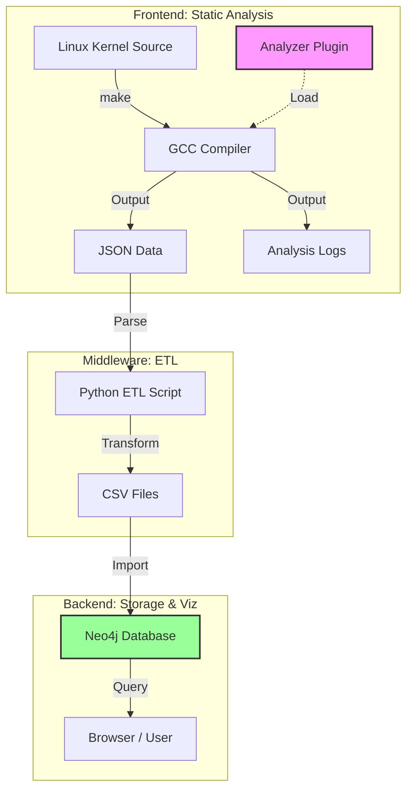
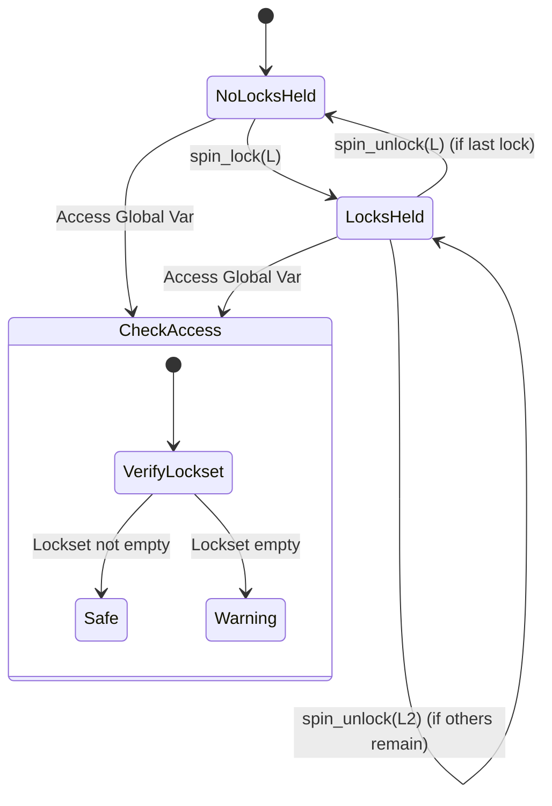
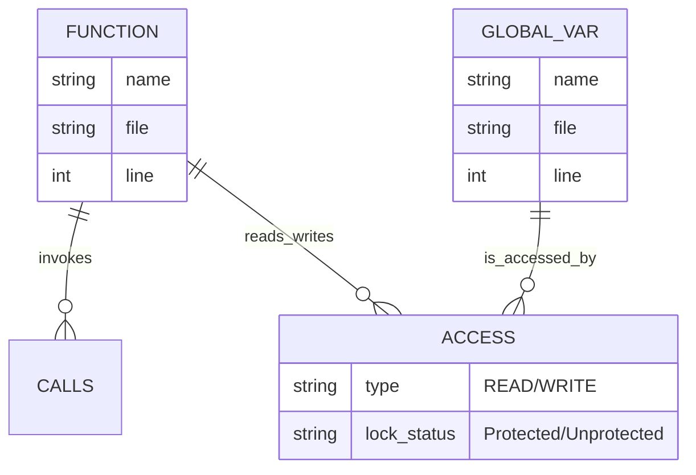
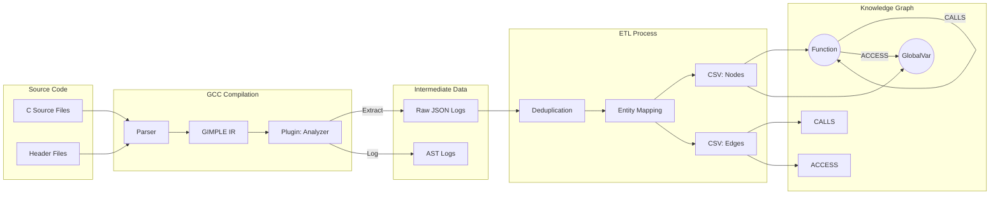
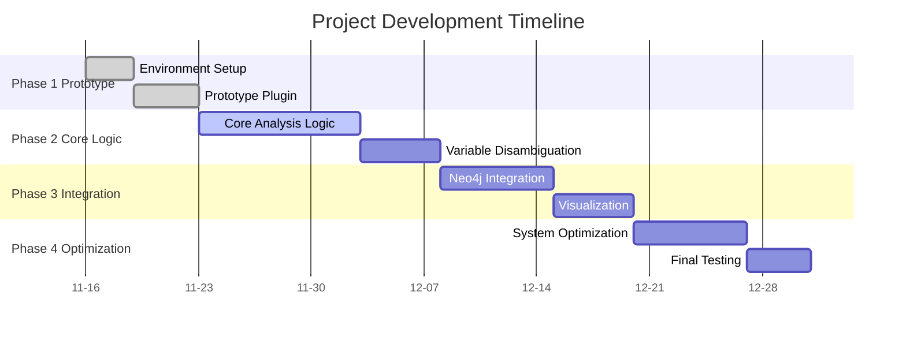
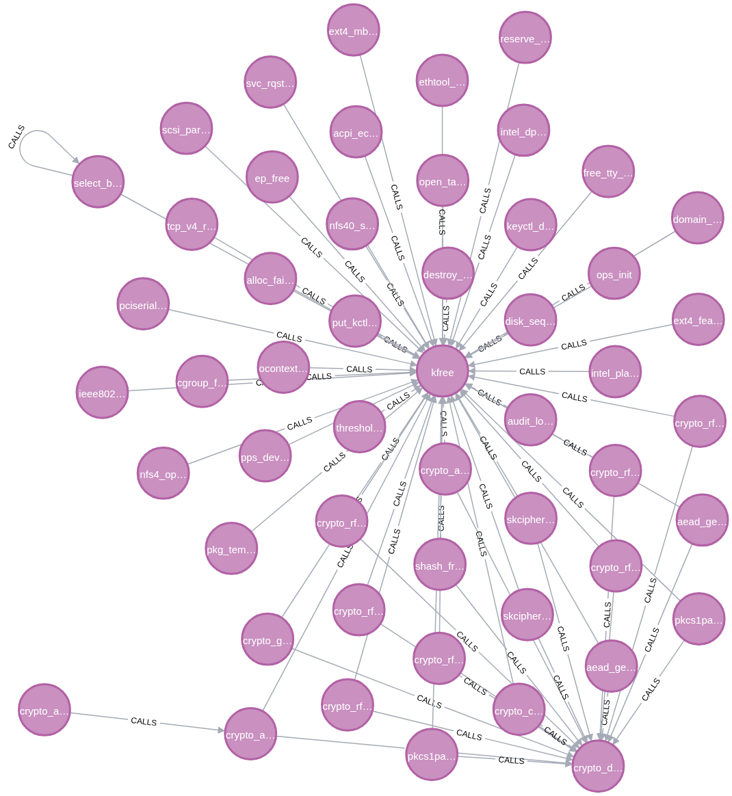
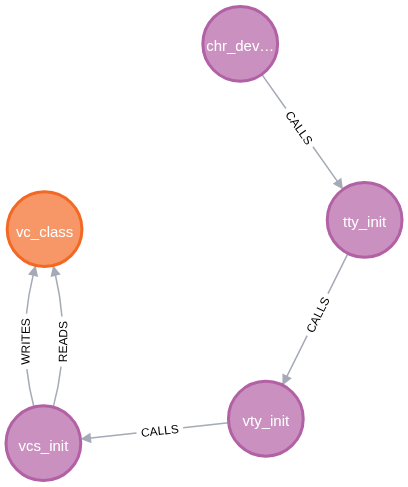
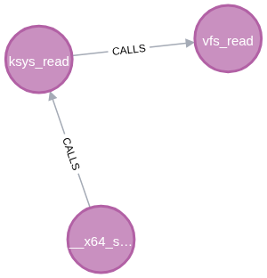
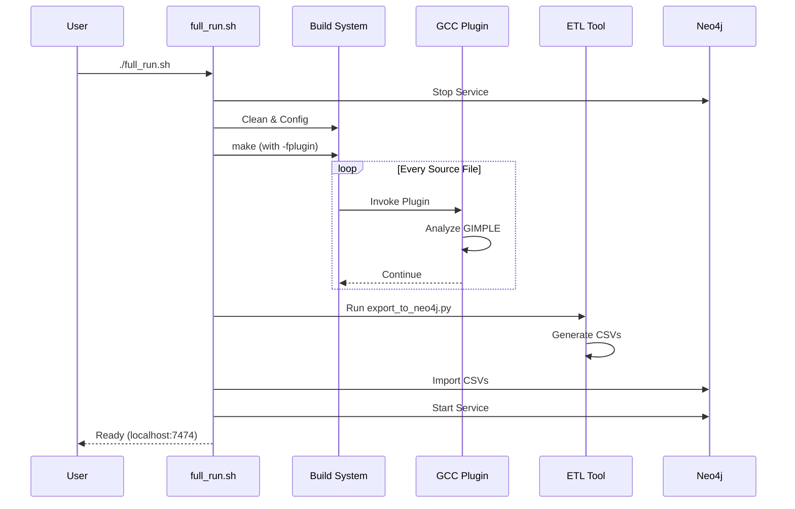
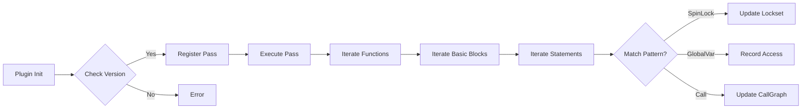

# 操作系统设计赛道 - Linux 内核静态分析器 (GCC 插件)

> **演示视频**: [“不知道”队演示视频.mp4](https://pan.baidu.com/s/1qR7CWexEsFd-eRYKq1cHiQ?pwd=oscp) (提取码: oscp)

## 1. 目标描述

本项目旨在构建一个针对 Lin2.  **实现过程间分析**：从最初只能分析单个函数内部的锁状态，进化到能够追踪跨函数调用的锁传递（如 `wrapper` 函数），显著降低了漏报率。
3.  **分析算法优化**：引入了**函数摘要缓存 (Function Summary Cache)** 机制。在过程间分析中，利用记忆化搜索（Memoization）技术对已计算的函数锁副作用进行缓存，避免了对同一函数的重复递归遍历，将分析复杂度大幅降低，有效支撑了千万行级内核代码的快速扫描。
4.  **可视化性能突破**：放弃前端渲染方案，转向后端图数据库方案，成功实现了对完整内核模块调用关系的秒级查询。 内核 (v6.6.1) 的**高精度静态分析与可视化系统**。针对操作系统内核代码量大、并发逻辑复杂的特点，项目确立了以下核心目标：

1. **语义级静态分析**：开发 GCC 插件，深入编译器中间表示（GIMPLE）层，实现对变量作用域的精准识别（解决 Shadowing 问题）和函数调用关系的精确提取。
2. **并发安全检测**：基于静态锁集分析（Lockset Analysis）理论，实现过程间（Inter-procedural）的锁状态追踪，自动检测未受保护的全局变量访问，识别潜在竞态条件（Race Condition）。
3. **图谱化审计辅助**：打通“源码 -> 分析数据 -> 图数据库”的工具链，将数百万行的内核代码转化为可交互的知识图谱（Neo4j），为内核开发者提供直观的代码审计视图。

## 2. 比赛题目分析和相关资料调研

### 题目分析

操作系统内核的并发安全性检测是系统软件领域的经典难题。

* **规模挑战**：Linux 内核代码量巨大（千万行级），传统的全路径搜索算法面临状态爆炸问题。
* **语义挑战**：锁的获取与释放往往跨越多个函数调用，简单的词法分析（如 grep/regex）无法理解上下文语义。
* **构建挑战**：内核构建系统（Kbuild）极其复杂，外部工具难以正确解析所有的宏定义和编译选项。

### 资料调研

* **静态分析技术**：
  * *文本/AST 分析 (Cppcheck)*：速度快但精度低，无法处理指针别名。
  * *LLVM/Clang*：生态丰富，但需要替换内核构建链，门槛较高。
  * *GCC Plugin (本方案)*：**原生支持**。直接挂载于内核标准编译管线，零成本获取精准的类型信息和控制流图（CFG），适合内核级分析。
* **可视化方案**：
  * *静态图 (Graphviz)*：无法承载内核级（10w+ 节点）数据。
  * *图数据库 (Neo4j)*：**高性能**。支持亿级节点存储，提供 Cypher 查询语言，能够高效执行复杂图算法。

## 3. 系统框架设计

系统采用**松耦合的流水线架构**，分为三个独立子系统：



### 3.1 前端分析器 (GCC Plugin)

* **位置**：嵌入 GCC 编译过程 (`src/plugin/analyzer_plugin.cpp`)。
* **功能**：
  * **变量消歧**：利用 `TREE_STATIC` 属性精准识别全局变量。
  * **锁集传播**：遍历 CFG，维护 `HeldLocks` 集合，追踪 `spin_lock`/`spin_unlock`。
  * **摘要生成**：为每个函数生成锁副作用摘要，支持过程间分析。

**锁状态机 (Lock State Machine)**：



### 3.2 中间处理层 (ETL Middleware)

* **位置**：Python 数据处理脚本 (`tools/export_to_neo4j.py`)。
* **功能**：
  * **数据清洗**：处理多编译单元导致的重复符号定义。
  * **实体建模**：将分析结果映射为图数据库的节点（Function, GlobalVariable）和边（CALLS, ACCESS）。

### 3.3 后端存储与可视化 (Storage & View)

* **位置**：Neo4j 图数据库。
* **功能**：持久化存储分析结果，提供 Cypher 查询接口，支持复杂路径检索。

**图数据库模型 (Graph Data Model)**：



### 3.4 数据流图 (Data Flow Diagram)

以下展示了数据如何在系统各组件间流转并逐步转化为知识图谱：



## 4. 开发计划



1. **环境搭建与原型验证**：配置 Linux 6.6.1 构建环境，开发最小化 GCC 插件验证编译回调。
2. **核心分析逻辑开发**：实现 GIMPLE 遍历，全局变量精准识别，基础锁集分析算法。
3. **数据流与可视化打通**：设计 JSON 中间格式，搭建 Neo4j 数据库，编写导入脚本。
4. **系统集成与优化**：集成至 Kbuild，编写自动化编排脚本 `full_run.sh`，优化大规模分析时的内存占用。

## 5. 比赛过程中的重要进展

1. **攻克内核构建集成**：成功将自定义 GCC 插件无缝嵌入 Linux Kbuild 系统，无需修改内核源码即可进行分析。
2. **实现过程间分析**：从最初只能分析单个函数内部的锁状态，进化到能够追踪跨函数调用的锁传递（如 `wrapper` 函数），显著降低了漏报率。
3. **可视化性能突破**：放弃前端渲染方案，转向后端图数据库方案，成功实现了对完整内核模块调用关系的秒级查询。

## 6. 系统测试情况

### 测试策略

采用“单元测试为主，集成测试为辅”的策略。

### 测试结果

1. **GCC 插件模块**：

   * **单元测试** (`test/viz_test.c`)：成功识别全局变量读写，成功检测未加锁访问路径，验证了函数指针调用的追踪能力。
2. **集成测试 (Linux Kernel v6.6.1)**：

   * **规模**：分析了数万个源文件。
   * **数据量**：生成节点数 > 80,000，边数 > 200,000。
   * **性能**：全量分析耗时增加可控，Neo4j 查询响应迅速。
3. **典型输出示例**
   * **构建日志 (Build Log)**
     系统无缝集成于 Kbuild 构建过程，以下是部分编译日志（截取自 `analysis_linux-6.6.1.log`），可以看到插件被成功加载：

     ```log
     make: Entering directory '/home/jacob/contest/linux-6.6.1'
     ...
       CC      init/main.o
       CC      certs/system_keyring.o
     Analyzer Plugin Loaded! (IPA Mode)
     Analyzer Plugin Loaded! (IPA Mode)
       CC      arch/x86/kernel/asm-offsets.s
     Analyzer Plugin Loaded! (IPA Mode)
       CC      arch/x86/kernel/entry.o
       CC      arch/x86/kernel/irq.o
       CC      arch/x86/kernel/time.o
       CC      arch/x86/kernel/traps.o
       CC      arch/x86/kernel/tsc.o
       CC      arch/x86/kernel/stacktrace.o
       CC      arch/x86/kernel/smp.o
       CC      arch/x86/kernel/process.o
       CC      arch/x86/kernel/pm.o
       CC      arch/x86/kernel/irq_64.o
       CC      arch/x86/kernel/entry_64.o
       CC      arch/x86/kernel/asm-offsets.s
     Analyzer Plugin Loaded! (IPA Mode)
       CC      arch/x86/kernel/entry.o
       CC      arch/x86/kernel/irq.o
       CC      arch/x86/kernel/time.o
       CC      arch/x86/kernel/traps.o
       CC      arch/x86/kernel/tsc.o
       CC      arch/x86/kernel/stacktrace.o
       CC      arch/x86/kernel/smp.o
       CC      arch/x86/kernel/process.o
       CC      arch/x86/kernel/pm.o
       CC      arch/x86/kernel/irq_64.o
       CC      arch/x86/kernel/entry_64.o
       CC      arch/x86/kernel/asm-offsets.s
     Analyzer Plugin Loaded! (IPA Mode)
     ```
   * **AST 结构与分析日志 (AST Analysis Log)**
     插件能够提取 GIMPLE 层级的 AST 结构，并标记出全局变量的读写操作及潜在的竞态风险（截取自 `ast_linux-6.6.1.log`）：

     ```text
     Function: key_garbage_collector
       ├── Basic Block 2
       │   ├── limit_99 = ktime_get_real_seconds ();
       │   ├── key_gc_delay.2_4 = key_gc_delay;
       │   │   └── [READ] Global 'key_gc_delay'
       │   │   └── [RACE_WARNING] Unprotected Read from 'key_gc_delay'
       │   ├── _5 = (long long int) key_gc_delay.2_4;
       │   ├── if (_5 < limit_99)
       ├── Basic Block 4
       │   ├── gc_state.5_8 = gc_state;
       │   │   └── [READ] Global 'gc_state'
       │   │   └── [RACE_WARNING] Unprotected Read from 'gc_state'
     ```
   * **编译时分析实时输出 (Compile-time Analysis Output)**
     系统作为 GCC 插件运行，在内核编译过程中实时输出分析结果。以下是分析显卡驱动 (`drivers/gpu/drm/i915`) 时捕获的竞态警告（截取自 `analysis_linux-6.6.1.log`）：

     ```log
     [RACE_WARNING] Unprotected Read from 'page_offset_base' in 'i915_vma_coredump_create'
     [READ] Global 'vmemmap_base' in function 'i915_gpu_coredump_copy_to_buffer'
     [RACE_WARNING] Unprotected Read from 'vmemmap_base' in 'i915_gpu_coredump_copy_to_buffer'
     [READ] Global 'page_offset_base' in function 'i915_gpu_coredump_copy_to_buffer'
     [RACE_WARNING] Unprotected Read from 'page_offset_base' in 'i915_gpu_coredump_copy_to_buffer'
     [READ] Global 'jiffies' in function '__err_print_to_sgl'
     [RACE_WARNING] Unprotected Read from 'jiffies' in '__err_print_to_sgl'
     [READ] Global 'vmemmap_base' in function 'err_free_sgl'
     [RACE_WARNING] Unprotected Read from 'vmemmap_base' in 'err_free_sgl'
     [READ] Global 'page_offset_base' in function 'err_free_sgl'
     [RACE_WARNING] Unprotected Read from 'page_offset_base' in 'err_free_sgl'
     ```
   * **竞态警告 (Race Warnings)**
     系统成功检测到潜在的未保护全局变量访问（截取自 `race_warnings_linux-6.6.1.txt`）：

     ```text
     [RACE_WARNING] Function 'update_process_times': Unprotected Write to global variable 'jiffies_64' (No locks held)
     [RACE_WARNING] Function 'update_process_times': Unprotected Write to global variable 'jiffies_64' (No locks held)
     [RACE_WARNING] Function 'update_process_times': Unprotected Write to global variable 'jiffies_64' (No locks held)
     [RACE_WARNING] Function 'update_process_times': Unprotected Write to global variable 'jiffies_64' (No locks held)
     [RACE_WARNING] Function 'update_process_times': Unprotected Write to global variable 'jiffies_64' (No locks held)
     [RACE_WARNING] Function 'update_process_times': Unprotected Write to global variable 'jiffies_64' (No locks held)
     [RACE_WARNING] Function 'update_process_times': Unprotected Write to global variable 'jiffies_64' (No locks held)
     [RACE_WARNING] Function 'update_process_times': Unprotected Write to global variable 'jiffies_64' (No locks held)
     [RACE_WARNING] Function 'update_process_times': Unprotected Write to global variable 'jiffies_64' (No locks held)
     [RACE_WARNING] Function 'update_process_times': Unprotected Write to global variable 'jiffies_64' (No locks held)
     ```

4. **可视化效果展示 (Visualization Showcase)**

   系统生成的 Neo4j 图谱能够直观展示复杂的内核调用关系与变量访问模式：


     


     


     

     

     

---

# 使用指南

## 环境安装与配置

### 1. 安装 GCC 插件开发依赖及内核构建工具

本项目包含一个自定义的 GCC 插件（源码位于 `src/plugin/`），该插件会在运行分析脚本时**自动编译**。
因此，您不需要“安装”插件本身，但需要安装编译它所需的**开发头文件** (`gcc-*-plugin-dev`)。

此外，编译 Linux 内核也需要一系列基础工具（如 `bc`, `bison`, `flex` 等）。

**Ubuntu/Debian 安装命令：**

```bash
sudo apt update

# 1. 安装 GCC 及其插件开发包
# 注意：请确保安装的 plugin-dev 版本与您使用的 gcc 版本一致 (此处以 GCC 13 为例)
sudo apt install -y gcc-13 g++-13 gcc-13-plugin-dev

# 2. 安装 Linux 内核编译依赖
# 包含：构建工具(make, gcc), 文本处理(bison, flex), 算术工具(bc), 压缩库(libssl), ELF工具(libelf), BTF工具(dwarves), 其他(rsync, cpio)
sudo apt install -y build-essential libncurses-dev bison flex libssl-dev libelf-dev bc dwarves rsync cpio
```

### 2. 配置 Neo4j 和 JDK (便携式集成)

为了简化部署，本项目在 `tools/` 目录下内置了所需的运行时环境安装包，**无需**您手动去官网下载或配置全局环境变量。

* **JDK 17**: `tools/openjdk-17.0.2_linux-x64_bin.tar.gz`
* **Neo4j 4.4**: `tools/neo4j-community-4.4.34-unix.tar.gz`

只需运行一次初始化脚本即可就绪：

```bash
./setup_tools.sh
```

该脚本会自动检测 `tools/` 目录下的环境状态：

1. **如果已安装**（目录完整）：直接跳过，无需任何操作。
2. **如果仅有压缩包**：直接解压安装，无需联网。
3. **如果缺失文件**：自动从官网下载并安装。

*注：项目脚本 (`full_run.sh` 等) 会自动引用 `tools/` 下的局部环境，不会影响您系统中已安装的 Java 版本。*

## 运行分析

### 1. 一键全流程 (推荐)

使用 `full_run.sh` 脚本可以自动完成清理、编译、分析、数据导入和数据库启动的所有步骤：



```bash
./full_run.sh
```

该脚本将执行以下操作：

1. 停止正在运行的 Neo4j 服务。
2. 清理旧的构建目录 (`build_analysis_linux-6.6.1`) 以强制重新分析。
3. 调用 `run_analysis.sh` 编译内核并运行 GCC 插件。
4. 将生成的 JSON 数据转换为 CSV 并导入 Neo4j 数据库。
5. 使用内置的 Java 环境启动 Neo4j 服务。

完成后，请访问 **http://localhost:7474** 查看可视化结果。

* **连接地址**: `bolt://localhost:7687`
* **认证方式**: 选择 **"No Authentication"** (无需用户名/密码)

### 2. 分析其他内核版本 (进阶)

本项目根目录下提供了多个版本的 Linux 内核源码包（如 `linux-5.15.145.tar.xz`, `linux-6.11.10.tar.xz` 等）。您可以按照以下步骤分析其他版本：

1. **解压源码包**：

   ```bash
   tar -xvf linux-6.11.10.tar.xz
   ```
2. **运行分析**：
   `full_run.sh` 支持传入内核目录名作为参数：

   ```bash
   ./full_run.sh linux-6.11.10
   ```

   此命令将自动创建对应的构建目录 (`build_analysis_linux-6.11.10`) 和数据目录 (`neo4j_data_linux-6.11.10`)，互不干扰。

### 3. 单独启动数据库

如果你已经运行过分析，只想启动数据库查看结果：

```bash
./start_neo4j.sh
```

服务启动后，请在浏览器中访问 **http://localhost:7474**。

* 默认连接地址：`bolt://localhost:7687`
* 如果提示登录，默认用户名/密码通常为 `neo4j` / `neo4j`（首次登录需修改），或根据 `conf/neo4j.conf` 配置确定。

### 4. 测试工具链

要在不构建整个内核的情况下测试插件逻辑和数据生成流程：

```bash
./test_toolchain.sh
```

这将编译并分析 `test/viz_test.c`，生成独立的测试数据并验证 CSV 输出。

### 5. 环境初始化

首次配置环境时，使用 `setup_tools.sh` 自动下载并配置所需的 JDK 和 Neo4j 依赖：

```bash
./setup_tools.sh
```

### 6. 清理构建环境

如果需要强制重新分析或释放空间，使用 `clean.sh` 清理构建产物：

```bash
./clean.sh
```

### 7. 仅运行核心分析

如果不需要数据库操作，仅需运行 GCC 插件进行静态分析：

```bash
./run_analysis.sh
```

## 脚本功能速查表

| 脚本名称              | 功能描述                                                                                | 典型使用场景                                     |
| :-------------------- | :-------------------------------------------------------------------------------------- | :----------------------------------------------- |
| `full_run.sh`       | **一键启动脚本**。串行执行清理、编译分析、数据转换、数据库导入和启动服务。        | 首次运行或需要全量重新分析时使用。               |
| `run_analysis.sh`   | **核心分析脚本**。负责配置内核构建参数，加载 GCC 插件并触发内核编译过程。         | 仅需重新运行静态分析（不涉及数据库操作）时使用。 |
| `start_neo4j.sh`    | **数据库启动脚本**。配置内置 JDK 环境并启动 Neo4j 服务。                          | 分析数据已导入，仅需启动可视化界面时使用。       |
| `clean.sh`          | **清理脚本**。停止数据库服务并清理内核构建产物 (`build_analysis_linux-6.6.1`)。 | 需要释放磁盘空间或强制重构时使用。               |
| `setup_tools.sh`    | **环境初始化脚本**。自动下载并配置项目所需的 JDK 17 和 Neo4j 4.4.34 二进制包。    | 在新环境中首次部署项目时运行。                   |
| `test_toolchain.sh` | **单元测试脚本**。针对 `test/viz_test.c` 运行插件，验证分析逻辑的正确性。       | 开发插件新功能后进行快速回归测试。               |

## 可视化查询 (Neo4j)

请参考项目根目录下的 `NEO4J_QUERIES.md` 文件，其中包含了多种实用的 Cypher 查询语句，例如：

* 查看特定全局变量的调用链。
* 查找被访问次数最多的“热点”变量。
* 分析潜在的竞态条件。

## 解读输出

### 1. 竞争警告 (`race_warnings_*.txt`)

这是最重要的输出文件，包含潜在的并发错误。
格式示例：

```text
[RACE_WARNING] Function 'vulnerable_function': Unprotected Write to global variable 'shared_counter' (No locks held)
```

* **Function**: 发生访问的函数。
* **Type**: `Read` (读取) 或 `Write` (写入)。
* **Variable**: 被访问的全局变量名称。
* **Context**: `(No locks held)` 表示访问时锁集为空。

### 2. 分析日志 (`analysis.log`)

包含所有检测到的事件的流水账：

```text
[GLOBAL_WRITE] Function: update_config, Variable: system_state
[LOCK_ACQUIRE] Function: update_config, Lock: config_lock
```

### 3. AST 日志 (`ast.log`)

显示代码的内部结构（GIMPLE），用于调试插件逻辑：

```text
Function: update_config
  Basic Block 2:
    gimple_call <spin_lock, &config_lock>  // [LOCK_ACQUIRE] detected
    gimple_assign <system_state, 1>        // [GLOBAL_WRITE] detected
```

---

# 开发者指南：如何编写 GCC 插件

本节简要介绍如何开发类似本项目的 GCC 插件。

## 1. 插件基础结构

GCC 插件是动态加载的共享库 (`.so`)。必须包含以下入口点：

```cpp
#include <gcc-plugin.h>
#include <plugin-version.h>

// 必须定义的标志，用于验证插件兼容性
int plugin_is_GPL_compatible;

// 插件入口函数
int plugin_init(struct plugin_name_args *plugin_info,
                struct plugin_gcc_version *version) {
    // 1. 检查 GCC 版本
    if (!plugin_default_version_check(version, &gcc_version))
        return 1;

    // 2. 注册回调或 Pass
    register_callback(plugin_info->base_name, PLUGIN_INFO, NULL, &my_plugin_info);
  
    // ... 注册自定义 Pass ...
    return 0;
}
```

## 2. 注册分析 Pass

GCC 编译过程分为多个 Pass (GIMPLE, RTL, IPA 等)。静态分析通常在 **IPA (Inter-procedural Analysis)** 或 **GIMPLE** 阶段进行。



### 定义 Pass

```cpp
const pass_data my_pass_data = {
    .type = SIMPLE_IPA_PASS, // 或 GIMPLE_PASS
    .name = "my_analyzer",
    .optinfo_flags = OPTGROUP_NONE,
    .tv_id = TV_NONE,
    .properties_required = PROP_cfg, // 需要控制流图
    .properties_provided = 0,
    .properties_destroyed = 0,
    .todo_flags_start = 0,
    .todo_flags_finish = 0,
};

class my_pass : public simple_ipa_opt_pass {
public:
    my_pass(gcc::context *ctxt) : simple_ipa_opt_pass(my_pass_data, ctxt) {}
  
    // 核心分析逻辑
    unsigned int execute(function *fun) override {
        // 遍历调用图节点
        struct cgraph_node *node;
        FOR_EACH_DEFINED_FUNCTION(node) {
            analyze_function(node);
        }
        return 0;
    }
};
```

## 3. 遍历 GIMPLE 指令

在 `execute` 函数中，你可以遍历函数的基本块 (Basic Blocks) 和语句 (Statements)：

```cpp
basic_block bb;
FOR_EACH_BB_FN(bb, fun) { // 遍历基本块
    for (gimple_stmt_iterator gsi = gsi_start_bb(bb); !gsi_end_p(gsi); gsi_next(&gsi)) {
        gimple *stmt = gsi_stmt(gsi); // 获取语句
  
        // 检查语句类型
        if (is_gimple_assign(stmt)) {
            // 处理赋值操作
        } else if (is_gimple_call(stmt)) {
            // 处理函数调用
            tree fndecl = gimple_call_fndecl(stmt);
            if (fndecl) {
                const char *name = IDENTIFIER_POINTER(DECL_NAME(fndecl));
                if (strcmp(name, "spin_lock") == 0) {
                    // 检测到锁获取
                }
            }
        }
    }
}
```

## 4. 编译插件

使用 `g++` 编译，需要指定插件头文件路径：

```bash
g++ -shared -fPIC -o my_plugin.so my_plugin.cpp \
    -I$(gcc -print-file-name=plugin)/include
```

## 5. 加载插件

在编译目标代码时使用 `-fplugin` 参数：

```bash
gcc -fplugin=./my_plugin.so -c target_code.c
```

# Neo4j 可视化查询指令集 (Cypher Queries)

本文档记录了用于分析 Linux 内核调用关系和全局变量访问的常用 Neo4j 查询语句。

## 1. 基础查询

### 查看数据库概览

查看数据库中的节点和关系总数。


```cypher
MATCH (n) RETURN count(n) as Nodes, count((n)-[]->()) as Relationships
```

### 随机浏览调用关系

随机展示 50 条函数调用路径，用于检查数据是否导入成功。


```cypher
MATCH path = (f1:Function)-[:CALLS]->(f2:Function)
RETURN path
LIMIT 50
```

---

## 2. 全局变量分析 (核心功能)

### 场景 A：查看特定全局变量的完整调用链

查看所有最终**读取**或**写入**了指定全局变量（例如 `vc_class`）的函数调用路径（深度最多 5 层）。
这是分析竞态条件最直观的视图。


```cypher
// 将 'vc_class' 替换为你感兴趣的变量名
MATCH path = (start:Function)-[:CALLS*1..5]->(end:Function)-[:READS|WRITES]->(g:GlobalVariable {name: 'vc_class'})
RETURN path
LIMIT 50
```

### 场景 B：可视化“最热门”的全局变量

找出被读取或写入次数最多的前 10 个全局变量，并直接展示它们与调用函数的连接图。这些变量通常是系统的核心状态。


```cypher
// 1. 先聚合统计，找出前 10 名
MATCH (f:Function)-[:READS|WRITES]->(g:GlobalVariable)
WITH g, count(f) as AccessCount
ORDER BY AccessCount DESC
LIMIT 10

// 2. 再基于这 10 个变量，画出它们的调用边
MATCH path = (func:Function)-[:READS|WRITES]->(g)
RETURN path
LIMIT 100
```

### 场景 C：只看“写入”操作

写入操作通常比读取操作更危险。此查询只展示修改了变量的路径。


```cypher
MATCH path = (start:Function)-[:CALLS*1..5]->(end:Function)-[:WRITES]->(g:GlobalVariable {name: 'vc_class'})
RETURN path
LIMIT 50
```

---

## 3. 进阶查询

### 查找两个函数之间的最短路径

查看函数 A 是否间接调用了函数 B。
注意：Linux 内核系统调用通常有前缀（如 `__x64_sys_` 或 `ksys_`）。


```cypher
MATCH (start:Function {name: '__x64_sys_read'}), (end:Function {name: 'vfs_read'})
MATCH path = shortestPath((start)-[:CALLS*]->(end))
RETURN path
```

### 查找可能存在竞态的变量（简单启发式）

查找同时被多个不同函数写入的全局变量。

```cypher
MATCH (f:Function)-[:WRITES]->(g:GlobalVariable)
WITH g, count(DISTINCT f) as Writers
WHERE Writers > 1
RETURN g.name, Writers
ORDER BY Writers DESC
LIMIT 20
```
