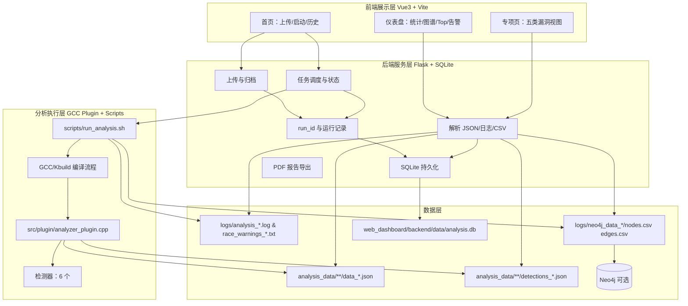
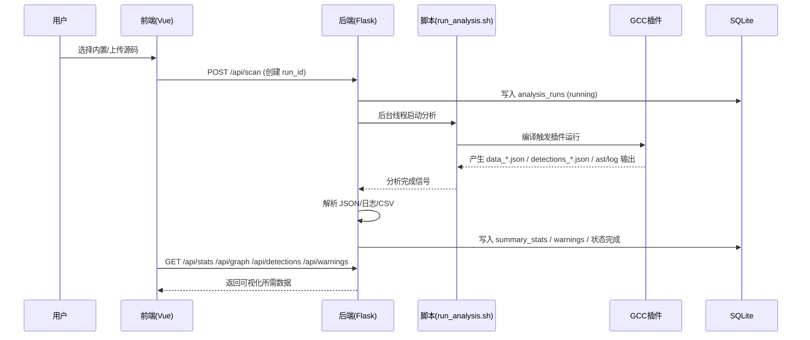

## Linux 内核静态分析与可视化平台（大数据赛道作品说明书 / 技术白皮书）

> 本文档面向：**计算机设计大赛（大数据赛道）**的作品提交、答辩陈述与技术白皮书撰写。
>
> 说明：仓库中 `README.md` 为简版入口；`docs/README.md` 为项目内部技术说明。本文为**比赛版 New_README**，强调赛道契合度、数据链路、工程化与创新点。

> 技术方案正式稿（总述+技术路线图+分模块原理+算法改进+原创/非原创+参考文献）见：`docs/技术方案_大数据赛道.md`。

---

## 0. 快速结论（给评委/答辩）

- **作品是什么**：一套面向 Linux 内核/大型 C 代码库的**静态分析数据生产 + 治理 + 可视化**平台。
- **为什么属于大数据赛道**：它把“编译期语义”抽取为大规模结构化数据（函数、调用、全局读写、锁上下文、漏洞事件），形成 **JSON + 日志 + 图谱 CSV + SQLite** 的多层数据资产，并提供**统一查询、统计聚合与可视化决策面板**。
- **能做什么**：上传/选择代码 → 自动生成分析数据 → 形成多运行 `run_id` 历史 → 仪表盘统计、图谱采样、告警分页、五类专项漏洞视图、PDF 报告导出；可选导入 Neo4j 做深度图查询。

---

## 1. 作品背景与问题定义（赛道语境）

### 1.1 背景
Linux 内核属于典型的“超大规模工程代码库”，具有：
- **规模大**：文件、函数、调用关系数量巨大；
- **并发复杂**：锁、共享状态、全局变量读写交织；
- **安全风险高**：竞态、TOCTOU、信息泄露、权限提升、内存安全问题具有高危后果；
- **人工审计难**：仅靠人工浏览难以覆盖全局关系与跨文件影响。

### 1.2 问题
将内核这种“复杂系统”的安全审计抽象为数据问题，本质上需要：
- **稳定地产生可复用数据**（不是一次性的日志）；
- **统一的任务与版本管理**（多次运行、多份报告）；
- **可查询、可聚合、可视化的指标体系**（给到评审/开发可决策结果）；
- **在产物缺失/旧版本布局存在时具备自愈能力**（工程交付更关键）。

### 1.3 目标
本作品目标是构建“**编译期语义数据工厂 + 安全检测与图谱化 + Web 可视化平台**”，把审计结果沉淀为可持续迭代的数据资产。

---

## 2. 作品概述（面向答辩的描述）

### 2.1 作品名称
`linux_kernel_safety_tool`：Linux 内核静态分析与可视化平台。

### 2.2 适用对象
- 内核/驱动开发与安全审计团队
- 静态分析/安全竞赛项目展示
- 需要对大型 C 工程做编译期语义抽取与图谱化的人群

### 2.3 核心能力清单
- **数据采集**：GCC 插件在 GIMPLE/IPA 阶段抽取语义数据
- **安全检测**：多检测器输出结构化漏洞事件
- **数据治理**：多运行 `run_id`、SQLite 持久化、历史复用
- **数据组织**：JSON/日志/CSV/SQLite 分层存储
- **可视化**：仪表盘统计、图谱采样、分页告警、专项页面
- **报告输出**：PDF 导出
- **可选图数据库**：CSV → Neo4j 导入深度查询

### 2.4 参赛作品概述（可直接用于申报表）

本作品以“**让内核安全审计从专家经验走向数据智能**”为主题创意，源于团队在真实开发与竞赛实践中的共同痛点：Linux 内核代码规模巨大、并发逻辑复杂、人工排查效率低且难以复现。围绕这一问题，我们提出“编译期语义数据工厂”思路，把原本分散在编译日志与代码细节中的安全线索，转化为可沉淀、可分析、可复用的大数据资产，并通过 Web 平台实现可视化决策。

作品主要面向三类用户群体：一是内核与驱动开发人员，用于在开发阶段提前发现高风险并发缺陷；二是安全研究与代码审计人员，用于快速定位全局变量访问、调用链与潜在漏洞热点；三是高校教学与竞赛团队，用于开展系统安全与静态分析的实践教学和成果展示。

在功能与特色上，作品形成了“采集-治理-服务-展示”一体化能力：通过 GCC 插件在 GIMPLE/IPA 层进行语义级抽取，输出函数调用关系、全局读写、锁上下文与多类漏洞事件；通过 `run_id` 管理多次运行快照，构建可追溯的数据版本体系；通过 SQLite 与统一 API 提供高效查询、分页告警与专题分析；通过仪表盘、图谱采样和 PDF 报告实现结果可视化与可交付。系统还具备产物缺失自愈、历史复用和可选 Neo4j 深度图查询能力，兼顾工程稳定性与扩展性。

本作品的应用价值体现在“技术价值+产业价值+教育价值”三个层面：技术上可提升内核安全检测的自动化与可解释性，降低人工审计成本；产业上可服务服务器操作系统、云平台基础设施、工业与车载嵌入式系统的软件安全治理；教育上可作为静态分析、软件安全与大数据工程融合实践的教学案例。通过在真实内核版本上的多轮分析验证，作品已具备较好的可落地性与可迁移性。

在推广前景方面，作品具备开源生态扩展与行业部署双路径：短期可在高校竞赛、实验课程和科研课题中快速复用；中期可对接 DevSecOps 流程，形成“提交即分析、告警即治理”的研发闭环；长期可扩展至更多大型 C/C++ 工程与多场景内核安全评估，形成以安全数据资产为核心的持续服务能力，具有良好的示范推广价值与产业化潜力。

### 2.5 源码核验口径（答辩建议按此表述）

为避免表述偏差，基于核心源码核验后，建议在申报与答辩中统一使用以下口径：

- 检测器数量为 **6 个**：`BufferOverflow`、`NullPointer`、`UseAfterFree`、`InfoLeak`、`PrivilegeEscalation`、`TOCTOU`；其中前三个统一归并为 `MemorySafety`。
- `RaceCondition` 页面数据来自插件锁集告警与 `race_warnings_*.txt`/`warnings` 表，不属于独立检测器类型。
- 专项接口 `GET /api/detections` 采用“**detections_*.json 优先，SQLite 告警回退**”的双通道策略，保证历史数据与异常场景下仍可展示。
- 统计数据以 `run_id` 为中心持久化到 SQLite（三张核心表：`analysis_runs`、`warnings`、`summary_stats`），并支持历史分页、筛选、删除与恢复。
- 图谱数据优先读取已有 `nodes.csv`/`edges.csv`；缺失时可由 `data_*.json` 自动调用 `tools/export_to_neo4j.py` 重建。
- 报告导出接口 `GET /api/report/pdf` 为内置轻量 PDF 生成链路，输出审计摘要与样例告警，满足比赛材料归档需求。

### 2.6 源码核验后的大赛作品概述终稿

本作品以“让内核安全审计从经验驱动走向数据驱动”为核心创意，围绕 Linux 内核这一典型超大规模复杂软件场景，构建了一个集语义抽取、安全检测、数据治理与可视化服务于一体的工程化平台。项目创意来源于团队在内核开发与安全审计中的真实痛点：代码体量大、并发路径复杂、跨函数行为难追踪、人工排查成本高且结论难复现。基于此，我们将“安全审计”抽象为“数据生产与数据服务”问题，通过 GCC 插件在编译期（GIMPLE/IPA）抽取函数调用、全局变量读写与漏洞事件等结构化信息，形成可持续沉淀的数据资产链路。

本作品主要面向三类用户：第一类是内核与驱动研发人员，用于在开发阶段提前发现并发与安全风险，降低缺陷流入上线阶段的概率；第二类是安全研究与代码审计人员，用于快速定位高风险函数、敏感变量与潜在漏洞热点，提高审计效率与覆盖深度；第三类是高校教学与竞赛团队，可作为系统安全、静态分析与大数据工程融合实践平台，支撑课程实验与项目展示。系统在功能上形成“采集-治理-服务-展示”闭环：分析引擎输出 `data_*.json` 与 `detections_*.json`，后端以 `run_id` 管理多轮任务快照并持久化至 SQLite，前端提供仪表盘、五类专题检测视图、历史记录与报告导出能力，实现从底层分析到上层决策的一体化流程。

在作品特色方面，平台具备较强工程韧性与扩展能力：一是采用“JSON 优先 + 告警回退”的数据读取策略，保障历史结果与异常场景下的可用性；二是支持产物缺失时由原始 JSON 自动重建 `nodes.csv` 与 `edges.csv`，提升系统稳定性；三是通过历史任务分页、筛选、恢复与删除机制，满足多次运行、多版本对比和长期归档需求。应用价值上，作品可服务操作系统内核安全治理、云与边缘基础设施审计、嵌入式与工业软件风险排查等场景；推广前景上，短期可在高校竞赛与课程体系中快速复制，中期可接入 DevSecOps 流程形成持续安全治理闭环，长期可扩展至更多大型 C/C++ 工程的静态安全分析与数据化运营，具备良好的示范推广价值与产业落地潜力。

---

## 3. 技术栈与工程形态

### 3.1 技术栈
- **前端**：Vue 3 + Vite + Vue Router + Axios + ECharts
- **后端**：Flask（Python）+ SQLite
- **分析引擎**：GCC Plugin（C++17）+ Bash 自动化（内核 Kbuild 触发）
- **图谱（可选）**：CSV ETL + Neo4j

### 3.2 工程形态
- Web 控制台负责“**任务/历史/展示**”，核心入口在 `web_dashboard/`
- 分析脚本负责“**一键驱动编译期抽取 + 产物生成**”，核心在 `scripts/run_analysis.sh`
- GCC 插件负责“**语义抽取 + 检测器执行 + 结构化输出**”，核心在 `src/plugin/`
- 数据产物按职责落盘到 `analysis_data/`、`logs/`、`web_dashboard/data/`、`web_dashboard/backend/data/analysis.db`

---

## 4. 大数据赛道契合度说明（核心论证）

### 4.1 数据规模与复杂性
本作品面向的对象（Linux 内核、或同规模 C 工程）具备典型的大数据特征：
- **数据源多样**：编译输出日志、函数语义、调用关系、变量读写、告警与漏洞事件
- **数据结构复杂**：函数—函数调用图、函数—全局变量读写图、锁上下文、漏洞事件多维属性
- **数据量可持续增长**：支持多运行 `run_id`，历史积累形成长期数据资产

### 4.2 数据链路完整
从数据采集到数据服务形成闭环：
- **采集**：GCC 编译期抽取（结构化 JSON）
- **治理**：`run_id` 运行单元、状态管理、结果复用
- **存储**：原始（JSON/日志）、中间（CSV）、服务化（SQLite）
- **服务**：统一 API（统计、图谱、分页告警、专项漏洞）
- **应用**：仪表盘、专项页、报告导出

### 4.3 数据服务化
平台将“分析产物”变为“可查询的数据服务”：
- SQLite 将适合查询/分页的摘要与告警固化（减少前端每次扫全量文件）
- API 按 `run_id` 提供稳定一致的数据接口
- 前端对统计/图谱/列表/专项视图形成完整的“数据产品”形态

---

## 5. 总体架构（白皮书级）

### 5.1 分层架构



### 5.2 关键设计点
- **以 `run_id` 作为“一次运行/一次数据快照”的唯一标识**：所有查询与展示都可复现到该运行。
- **原始数据与服务数据分层**：原始（JSON/日志）用于可追溯；服务化（SQLite）用于快速查询与分页。
- **可选图数据库**：Web 主流程不强依赖 Neo4j，但保留图查询扩展能力。

---

## 6. 目录结构（比赛讲解版）

```text
linux_kernel_safety_tool/
├── src/                        # GCC 插件与 CLI
│   ├── main.c                  # CLI 主程序
│   └── plugin/                 # analyzer_plugin.cpp + detectors/
├── scripts/                    # run_analysis.sh / start_all.sh 等
├── web_dashboard/
│   ├── backend/                # Flask app.py + SQLite
│   ├── frontend/               # Vue3 页面与可视化
│   └── data/                   # uploads/ 与 analysis_results/
├── analysis_data/              # 原始分析数据（JSON）与构建目录
├── logs/                       # 统一日志与 Neo4j CSV
├── tools/                      # export_to_neo4j.py + Neo4j/JDK（可选）
└── docs/                       # 文档目录
```

---

## 7. 核心功能与交互流程（答辩可直接照讲）

### 7.1 首页（任务入口）
首页承担“数据入口 + 任务控制 + 历史管理”三件事：
- **目标选择**：内置内核 / 上传文件夹 / 上传压缩包
- **任务控制**：启动分析、恢复最近任务、查看进度与滚动日志
- **历史管理**：按 `run_id` 打开历史报告、删除某次运行、（上传目标）清理全部结果

### 7.2 仪表盘（数据总览）
围绕一个 `run_id`，仪表盘聚合展示：
- **总体指标**：分析文件数、函数数、调用边、五类问题计数等
- **可视化**：类型分布、Top 10、高危全局变量与函数、拓扑图采样
- **明细列表**：分页告警（支持关键词与严重度筛选）

### 7.3 五类专项页面（结构化漏洞数据产品）
- `MemorySafety`（BufferOverflow / NullPointer / UseAfterFree）
- `RaceCondition`
- `InfoLeak`
- `PrivilegeEscalation`
- `TOCTOU`

专项页统一按 `run_id` + `type` 从后端拉取结构化漏洞列表，并提供筛选与统计展示。

### 7.4 报告输出
支持导出 PDF，形成可归档的审计报告（适合比赛提交与成果展示）。

---

## 8. 数据链路与产物规范（大数据赛道关键章节）

### 8.1 数据链路（端到端）



### 8.2 产物分层
- **原始结构化数据**（可追溯）：
  - `analysis_data/<target>/data_*.json`：函数语义（调用、全局读写等）
  - `analysis_data/<target>/detections_*.json`：结构化漏洞事件
- **运行日志**（可审计）：
  - `logs/analysis_<target>.log`：编译与分析全过程日志
  - `logs/ast_<target>.log`：插件调试/结构输出
  - `logs/race_warnings_<target>.txt`：竞态告警抽取
- **图谱 CSV**（可计算/可导入）：
  - `logs/neo4j_data_<target>/nodes.csv`、`edges.csv`
- **服务化数据**（可查询/可分页）：
  - `web_dashboard/backend/data/analysis.db`：`analysis_runs`、`warnings`、`summary_stats`

### 8.3 自愈/兜底（数据治理能力）
平台在“产物缺失/旧布局存在”时尽量保证展示不空：
- **CSV 缺失可重建**：缺少 `nodes.csv`/`edges.csv` 时，根据 `data_*.json` 调用 `tools/export_to_neo4j.py` 自动重建
- **分析文件数回退**：日志中统计失败时，可回退通过 `data_*.json` 数量估算
- **兼容旧目录布局**：在多处路径尝试读取历史产物，提升老数据复用率

---

## 9. 后端 API（答辩讲解版）

> 接口实现集中在 `web_dashboard/backend/app.py`，并以 `run_id` 为核心索引。

### 9.1 上传与任务
- `POST /api/upload`：上传文件夹/压缩包，写入 `web_dashboard/data/uploads/<target>/...`
- `GET /api/uploaded-archives`：列出历史上传压缩包目标
- `POST /api/scan`：创建运行记录并启动分析（或复用既有结果），返回 `run_id`
- `GET /api/scan/status`：查询运行状态/进度/日志（前端轮询）
- `GET /api/scan/recover`：恢复最近任务/结果

### 9.2 历史与系统状态
- `GET /api/history`：分页查询运行历史（支持条件筛选）
- `DELETE /api/history/<run_id>`：删除一次运行（上传目标可扩展清理全部结果）
- `GET /api/status`：探活

### 9.3 数据展示
- `GET /api/stats`：总览统计
- `GET /api/graph`：图谱采样（供拓扑展示）
- `GET /api/warnings`：告警分页（支持关键词/严重度）
- `GET /api/detections`：按 `type` 获取专项漏洞列表
- `GET /api/detections/summary`：五类专项计数摘要
- `GET /api/report/pdf`：导出 PDF

---

## 10. 分析引擎与检测器体系（白皮书级）

### 10.1 GCC 插件执行位置与原因
插件位于 `src/plugin/analyzer_plugin.cpp`，注册为 GCC 的 `simple_ipa_opt_pass` 并插入到特定 pass 之后执行。

选择编译期语义抽取的原因：
- 能得到更接近真实编译语义的中间表示（比纯文本扫描更可靠）
- 能天然关联函数、调用、变量读写与控制流片段

### 10.2 抽取的核心语义
对每个函数输出：
- 函数名
- 调用集合 `callees`
- 全局变量读取集合 `global_reads`
- 全局变量写入集合 `global_writes`

并维护过程间信息以支撑锁效应与竞态检测。

### 10.3 检测器（6 个）与前端五类归并
插件内注册 6 个检测器，前端按五类专项组织展示：
- `MemorySafety`：`BufferOverflow` / `NullPointer` / `UseAfterFree`
- `InfoLeak`
- `PrivilegeEscalation`
- `TOCTOU`
- `RaceCondition`（结合锁集与全局读写输出告警）

检测结果以 `detections_*.json` 结构化输出，并在后端聚合为摘要与列表。

---

## 11. 核心技术创新点（比赛重点章节）

> 本章是面向“大数据赛道”与“答辩创新点提问”的重点准备。

### 11.1 编译期语义数据工厂：用 GCC GIMPLE/IPA 抽取高可信结构化数据
- **创新点**：不同于文本正则或简单 AST 扫描，本作品在编译期进入 GCC 中间表示阶段，抽取函数调用、全局读写等语义数据。
- **价值**：数据质量更高，可支撑后续统计、图谱化、告警定位与可视化联动。

### 11.2 `run_id` 多运行快照：把一次分析固化为可复现的数据资产
- **创新点**：以 `run_id` 将一次运行的状态、产物与展示绑定，实现可回溯、可对比、可复盘。
- **价值**：符合大数据系统对“数据版本/批次”的管理要求，便于形成长期数据仓库。

### 11.3 原始数据与服务化数据分层：JSON/日志/CSV/SQLite 的多层治理
- **创新点**：原始 JSON/日志用于可追溯，CSV 用于图谱计算与导入，SQLite 用于高频查询/分页。
- **价值**：兼顾可解释性与交互性能，减少每次展示对海量文件的重复扫描。

### 11.4 结果自愈与兜底：面对缺产物/旧布局仍能稳定出数
- **创新点**：当 `nodes.csv`/`edges.csv` 缺失可由 `data_*.json` 重建；当日志统计失败可回退从 JSON 计数；兼容旧目录布局。
- **价值**：提升工程交付稳定性，适合比赛演示与长期迭代（“不会因为少一个文件就全空”）。

### 11.5 安全检测“产品化”：五类专项统一数据协议与页面呈现
- **创新点**：将检测器输出统一为结构化事件，按 `type` 形成五类专项“数据产品”，支持筛选、统计、列表化呈现。
- **价值**：把研究型检测输出转为可用的产品形态，提升可读性与演示表现。

### 11.6 图谱采样展示 + Neo4j 可选增强：兼顾轻量交互与深度查询
- **创新点**：Web 侧提供图谱采样满足交互展示，保留 CSV→Neo4j 的深度图查询能力。
- **价值**：在不强依赖重组件的前提下提供可扩展图能力，适合比赛环境的部署与演示。

### 11.7 在线任务调度与过程可观测：进度 + 日志滚动 + 恢复
- **创新点**：前端轮询状态与日志，支持恢复最近任务；后端管理运行状态并落 SQLite。
- **价值**：提升“可观测性”，让评委能看见平台在“跑数据—产出数据—服务数据”。

### 11.8 数据资产可输出：PDF 报告与可归档的运行目录
- **创新点**：对外输出 PDF 报告，并保留按 `run_id` 组织的结果目录。
- **价值**：符合比赛作品“成果可展示、可提交、可归档”的要求。

---

## 12. 运行与演示（比赛现场推荐脚本）

### 12.1 一键启动 Web 控制台

```bash
cd /home/ldd_team/linux_kernel_safety_tool
./scripts/start_all.sh
```

默认访问：
- 前端：`http://localhost:5173`
- 后端：`http://localhost:5000`

### 12.2 现场演示建议（3～5 分钟版本）
- **步骤 1**：进入首页，选择内置目标（如 `linux-6.6.1`），点击开始/打开报告
- **步骤 2**：进入仪表盘，讲清楚统计卡片、Top、图谱采样、告警分页
- **步骤 3**：切换五类专项页，展示结构化问题列表与筛选
- **步骤 4**：打开历史记录，说明 `run_id` 多次运行与复用
- **步骤 5**：导出 PDF，强调成果可提交与可归档

### 12.3 真实分析演示建议（时间充裕版本）
- 上传压缩包 → 启动审计 → 展示实时日志与进度 → 完成后切换仪表盘与专项页 → 在历史中看到新的 `run_id`

---

## 13. 环境与依赖（交付说明）

### 13.1 基础环境
- Linux（建议）
- GCC 工具链（用于编译期插件分析）
- Python（Flask 后端）
- Node.js（Vite 前端）

### 13.2 可选组件
- Neo4j：用于深度图查询（Web 主流程不强依赖）

---

## 14. 风险、边界与对策（答辩常问）

### 14.1 边界
- 分析依赖 GCC 编译链路，不适合脱离编译环境的纯源码扫描
- 竞态检测基于锁集与全局读写的静态启发式，不能等价于运行时“必然竞态证明”
- 大规模工程真实全量分析受 CPU/内存/磁盘影响

### 14.2 对策
- 预置结果与历史复用：保证演示稳定、降低现场耗时
- 数据自愈兜底：缺产物也能恢复显示
- 分层存储 + SQLite 服务化：提升查询与分页性能

---

## 15. 文档与材料产出建议（用于提交与论文）

如果你要把本作品扩写成正式材料，建议结构：
- **摘要/背景/问题定义**（安全审计 → 数据问题）
- **总体技术方案与系统架构**（分层、数据链路、run_id）
- **关键算法与检测器设计**（语义抽取、锁集、事件化输出）
- **数据治理与存储设计**（多层产物、SQLite 服务化、自愈兜底）
- **可视化与交互设计**（仪表盘、专项页、历史、PDF）
- **创新点与优势对比**（对比纯文本扫描、一次性脚本、单图展示等）
- **局限性与未来工作**（跨函数更强推理、更多图分析与指标体系）

---

## 16. 总结（可直接作为答辩结尾）

本作品将 Linux 内核安全审计工程化为一个“**大规模语义数据生产与服务系统**”：以 GCC 插件在编译期抽取高可信结构化数据，结合多检测器输出安全事件，通过 `run_id` 管理多运行历史并将结果服务化到 SQLite，最终以 Web 仪表盘与专项页实现可视化决策，并支持 PDF 与图谱导出，形成可复用、可归档、可扩展的数据资产闭环。
