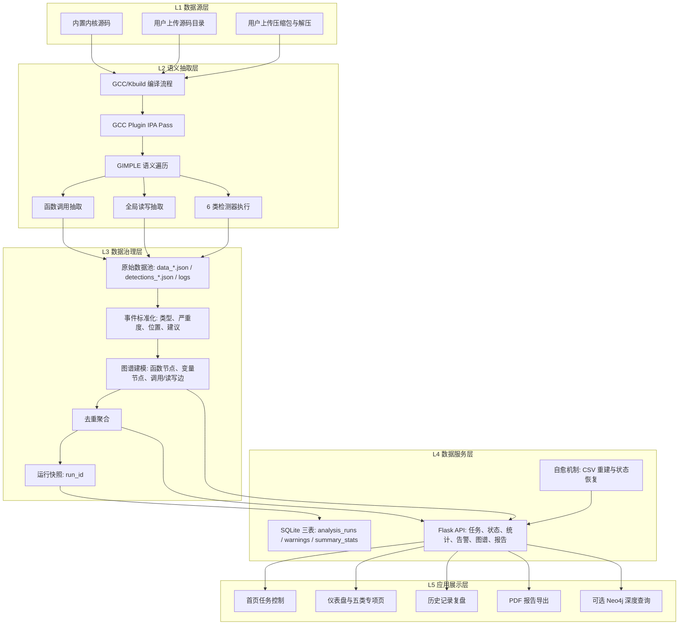

# 基于编译技术的Linux内核并发安全可视化审计平台技术方案（大数据赛道）

## 1. 总体技术方案

本项目采用“五层闭环架构”（L1-L5），面向 Linux 内核与大型 C 代码库构建可持续演进的安全审计体系：在 L1 数据源层统一接入内置内核、用户上传目录与压缩包解压入口，在 L2 语义抽取层依托 GCC/Kbuild 编译流程与 GCC 插件 IPA Pass 完成 GIMPLE 语义遍历、函数调用抽取、全局读写抽取及六类检测器执行，在 L3 数据治理层完成原始数据池汇聚、事件标准化、图谱建模、去重聚合与 `run_id` 运行快照管理，在 L4 数据服务层以 Flask API 与 SQLite 三表为核心提供任务状态、统计、告警、图谱和报告服务并通过 CSV 重建等机制实现自愈，在 L5 应用展示层支撑首页任务控制、仪表盘与五类专项页面、历史复盘、PDF 导出及可选 Neo4j 深度查询，最终形成“分析-治理-服务-交付”全链路闭环，使系统不仅输出一次性日志，而且沉淀出可追溯、可复用、可扩展的数据资产（包括 `data_*.json`、`detections_*.json`、`analysis_*.log`、`nodes.csv`、`edges.csv` 以及基于 SQLite 的运行记录、告警索引和统计摘要）。

### 1.1 技术路线框架图

### 1.2 体系化设计思路

- 上游分析引擎强调语义正确性：基于 GCC 中间表示（GIMPLE/IPA）抽取语义，避免纯文本匹配导致的上下文缺失。
- 中游数据治理强调结果可回溯：采用 `run_id` 作为分析快照主键，支持历史复盘、分页检索、结果恢复与复用。
- 下游数据服务强调决策可解释：将复杂分析结果投影为统一 API、统计指标、图谱关系与报告产物，降低解释与复核成本。

为便于答辩陈述，可按“自底向上”口径讲解：
- 先讲 L1/L2：数据从哪里来、如何在编译期变成语义数据。
- 再讲 L3：如何标准化、建模、去重并形成 run_id 资产。
- 最后讲 L4/L5：如何通过服务化接口支撑页面展示、报告导出与扩展查询。

## 2. 问题定义与解决思路

### 2.1 关键问题

- 代码规模问题：Linux 内核规模大、模块耦合深，人工审计难以覆盖完整调用链与共享状态。
- 并发语义问题：锁的获取与释放常跨函数传播，浅层扫描难以准确识别竞态风险。
- 结果治理问题：若仅保存日志文本，无法支撑历史对比、分页检索与可视化决策。

### 2.2 总体解法

- 以编译器插件嵌入标准构建流程，采集高可信语义数据。
- 以多检测器框架并行识别不同漏洞类型，统一导出结构化结果。
- 以 `run_id` + SQLite 将分析结果资产化，形成可查询、可管理、可展示的安全数据服务。

## 3. 分模块技术方案

### 3.1 编译期语义抽取模块（GCC Plugin）

工程实现：由 GCC 插件主程序与过程间分析 Pass 共同完成。

### 3.1.1 模型

采用“函数语义摘要模型（Function Summary）”：
- 每个函数映射为一个摘要对象，核心字段包括：函数名、被调函数集合、全局变量读集合、全局变量写集合。
- 摘要集合组成全局语义图，支持后续风险统计与关系可视化

### 3.1.2 关键算法

1. 控制流遍历：在 basic block 层遍历 GIMPLE 语句。
2. 调用关系抽取：识别 `gimple_call`，提取被调函数。
3. 全局访问抽取：识别赋值语句左右值中的全局变量访问。
4. 锁上下文追踪：基于 lockset 维护“当前持有锁集合”。

### 3.1.3 过程间锁效应传播

项目实现了跨函数锁效应估计：
- `get_lock_effect()` 递归分析被调函数的净锁效应（+1/-1/0）
- 使用 `lock_effect_cache` 做记忆化缓存，避免重复分析
- 使用 `visiting` 集合阻断递归环

该设计本质上将锁状态传播问题转化为一个带缓存的过程间数据流计算问题，兼顾精度和可扩展性。

### 3.2 安全检测器模块（6 类）

工程实现：基于独立检测器子模块与统一调度框架协同完成。

### 3.2.1 框架模型

采用“统一基类 + 管理器调度”的插件式检测器架构：
- `DetectorBase`：定义初始化、函数分析、收尾、结果导出等统一接口
- `DetectorManager`：注册检测器、顺序执行、汇总输出

该架构使检测能力可持续扩展，符合大数据工程中“多规则并行处理”的设计理念。

### 3.2.2 检测算法简述

1. BufferOverflow
- 通过数组边界检查与高风险字符串/内存函数模式匹配（如 `strcpy/memcpy`）识别潜在越界。
- 对非常量索引场景使用同块条件语句的边界检查启发式判断。

2. NullPointer
- 识别指针解引用点（`MEM_REF`）。
- 在当前 basic block 中搜索空值判定条件，缺失时产生告警。

3. UseAfterFree
- 识别 `free/kfree/vfree/...` 调用并记录释放指针集合。
- 后续访问命中释放集合时产生 use-after-free 告警。

4. InfoLeak
- 采用敏感标识符词典与输出通道识别（日志/错误/网络/文件）联合检测。
- 覆盖 `%p` 类地址泄露模式，补齐内核场景常见信息泄露风险。

5. PrivilegeEscalation
- 进行特权系统调用词典匹配。
- 检查特权变量写入和特权调用前的权限校验缺失问题。

6. TOCTOU
- 检测检查操作（access/stat/permission）与使用操作（open/rename/unlink）的组合模式。
- 结合同块、前驱块及函数级兜底启发式提升召回率。

### 3.3 调度与任务治理模块（Flask + SQLite）

工程实现：由后端服务主程序与数据库访问层共同支撑。

### 3.3.1 数据治理模型

采用“运行快照模型”：每次审计对应唯一 `run_id`。

数据库核心表：
- `analysis_runs`：任务状态与时间轴（running/completed/error）
- `warnings`：告警明细与可检索字段
- `summary_stats`：统计摘要与 TopN 聚合

### 3.3.2 协议与接口

后端采用 HTTP/REST 风格 API：
- 上传与任务：`/api/upload`、`/api/scan`、`/api/scan/status`、`/api/scan/recover`
- 数据展示：`/api/stats`、`/api/graph`、`/api/warnings`、`/api/detections`
- 治理与交付：`/api/history`、`/api/report/pdf`

### 3.3.3 工程化策略

- 快速复用策略：内置目标命中预置产物可跳过重跑。
- 上传复用策略：上传目标可复用最近已完成结果。
- 异常恢复策略：支持服务重启后从 SQLite 恢复最近可用任务。

### 3.4 数据转换与图谱模块（ETL）

工程实现：由 ETL 转换脚本完成原始数据到图谱交换格式的映射。

### 3.4.1 图模型

- 节点：`Function`、`GlobalVariable`
- 边：`CALLS`、`READS`、`WRITES`

### 3.4.2 转换策略

- 输入筛选：只读取 `data_*.json`，避免与 `detections_*.json` 混淆。
- 去重策略：节点字典去重、边集合去重。
- 标准输出：生成可导入 Neo4j 的 `nodes.csv`、`edges.csv`。

该模块将半结构化结果转换为图计算可用数据，为后续关系挖掘与证据链追踪提供基础。

### 3.5 前端可视化与报告模块（Vue + ECharts）

工程实现：由任务入口页面与仪表盘页面等前端核心组件共同实现。

### 3.5.1 可视化模型

- 首页：任务生命周期管理（上传、启动、进度、恢复、历史）
- 仪表盘：多维统计融合（文件、函数、边、五类风险）
- 专项页：按漏洞类型分域展示明细

### 3.5.2 交付形式

- 图表、表格、拓扑图三类结果联动展示
- 支持导出 PDF，满足竞赛归档与答辩交付需求

## 4. 涉及的模型、协议与算法

### 4.1 模型

- 函数语义摘要模型（Function Summary）
- 锁集模型（Lockset）
- 运行快照治理模型（run_id-based snapshot）
- 属性图模型（Property Graph: Function/Variable + Relation）

### 4.2 协议/标准

- HTTP/REST（前后端数据服务接口）
- CSV 规范（图谱交换格式）
- SQLite WAL 模式（并发读写友好的轻量持久化）

### 4.3 算法

- CFG/GIMPLE 遍历与语义抽取
- 带缓存的过程间锁效应传播
- 多规则模式匹配（内存、泄露、权限、TOCTOU）
- 图关系去重与 TopN 统计聚合

## 5. 算法改进与优化建议

结合当前实现，建议按“精度提升-治理优化-工程效率”三条主线持续迭代：

1. 锁语义精细化
- 当前以“函数名匹配 + 净效应”追踪锁状态，可进一步引入锁对象敏感分析（lock object-sensitive）减少误报。

2. 跨块/跨路径数据流增强
- NullPointer 与 TOCTOU 检测目前以块内/邻近块启发式为主，可增加路径敏感数据流框架以提高精度。

3. 检测结果归并与去重
- 对同一根因在不同路径重复告警可做聚类归并，输出“根因 + 证据路径集”。

4. 调度层增量分析
- 当前以全量构建为主，可增加“变更文件影响域”增量策略，提高持续集成场景效率。

5. 风险评分模型
- 在当前 HIGH/MEDIUM 分级基础上，引入综合风险分：
  `RiskScore = SeverityWeight × Reachability × Frequency × PrivilegeImpact`

## 6. 原创工作与非原创工作划分

### 6.1 原创工作（详述）

1. 面向内核场景的 GCC 插件式语义抽取落地
- 在真实工程构建链中抽取函数调用、全局读写、锁上下文并导出结构化数据。

2. 过程间锁效应缓存机制
- 通过 `lock_effect_cache + recursion guard` 实现可扩展的跨函数锁状态估计。

3. 六类检测器的一体化框架实现
- 完成统一接口、统一调度、统一导出，形成可扩展安全规则平台。

4. `run_id` 驱动的审计数据治理体系
- 将扫描结果从一次性日志升级为可持续治理的数据资产，支持复用、恢复与历史检索。

5. 数据自愈与工程稳健性机制
- 产物缺失时自动重建关键文件，提升平台在竞赛演示与真实运行中的可用性。

### 6.2 非原创工作（简述）

1. 编译器插件能力依赖 GCC 官方插件机制与 GIMPLE/IPA 框架。
2. 前端工程基础依赖 Vue/ECharts 等成熟开源框架。
3. 图数据库能力依赖 Neo4j 及其属性图查询生态。
4. 部分检测规则（如 lockset、TOCTOU 模式）借鉴经典静态分析思想并进行工程化实现。

## 7. 参考文献

[1] Nicholas Nethercote, Julian Seward. Valgrind: A Framework for Heavyweight Dynamic Binary Instrumentation. PLDI, 2007.

[2] Stefan Savage, Michael Burrows, Greg Nelson, Patrick Sobalvarro, Thomas Anderson. Eraser: A Dynamic Data Race Detector for Multithreaded Programs. ACM TOCS, 1997.

[3] Dawson Engler, David Yu Chen, Seth Hallem, Andy Chou, Benjamin Chelf. Bugs as Deviant Behavior: A General Approach to Inferring Errors in Systems Code. SOSP, 2001.

[4] GCC Team. GCC Internals Manual (Plugin Infrastructure, GIMPLE, IPA).

[5] MITRE. CWE-367: Time-of-check Time-of-use (TOCTOU) Race Condition.

[6] MITRE. CWE-119/CWE-476/CWE-416/CWE-200/CWE-269.

[7] Ian Robinson, Jim Webber, Emil Eifrem. Graph Databases. O'Reilly Media.

[8] Neo4j Documentation: Cypher Query Language and Bulk Import.

[9] SQLite Documentation: WAL Mode and Concurrency.

[10] Linux Kernel Documentation: Kernel locking and concurrency primitives.
