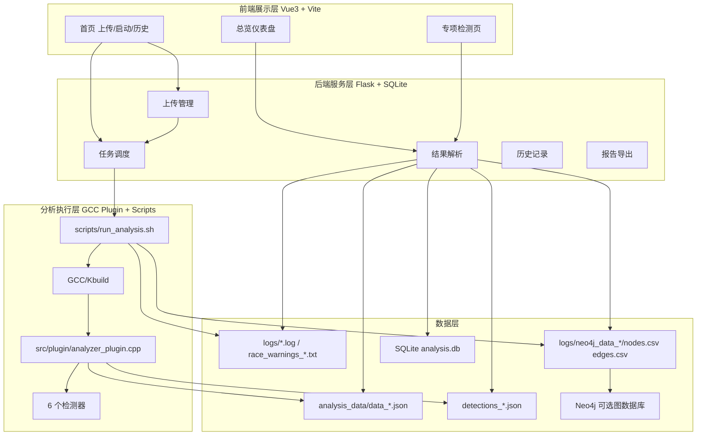
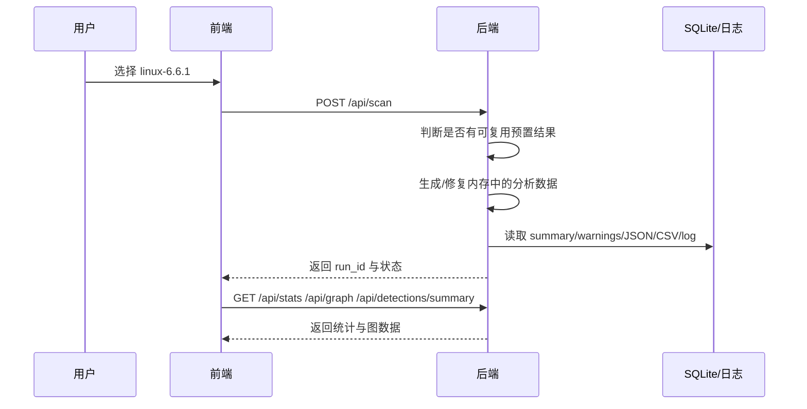
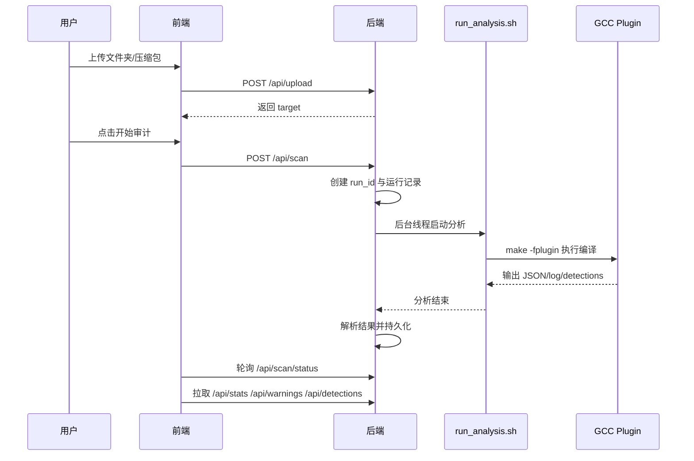

# Linux 内核静态分析与可视化平台

> 当前文档基于仓库现状重新编写，描述的是**当前实现版本**，不再沿用早期仅以 Neo4j 展示或单一竞态检测为核心的旧说明。
>
> 项目根目录简版说明见 `README.md`；本文档用于技术文档、项目说明书、答辩材料和实施方案撰写。

---

## 1. 项目定位

`linux_kernel_safety_tool` 是一个面向 Linux 内核及大型 C 代码库的静态分析平台。项目以 GCC 插件为底层分析引擎，在编译期直接进入 GCC 的 GIMPLE/IPA 阶段提取语义信息，并在此基础上构建 Web 化的分析控制台，实现以下完整链路：

1. 选择内置内核版本或上传源码/压缩包。
2. 后端统一调度分析任务，并为每次分析分配独立 `run_id`。
3. GCC 插件在编译过程中提取函数调用、全局变量读写、锁相关上下文，并执行多类安全检测器。
4. 生成 JSON、日志、竞态告警、图谱 CSV 等中间产物。
5. Flask 后端解析分析结果，缓存并落盘到 SQLite。
6. Vue 前端展示总览统计、图谱、分页告警、专项漏洞视图、历史记录和 PDF 报告。
7. 如有需要，再将 CSV 导入 Neo4j 做图数据库级别的深度查询。

因此，该项目不是“单个 GCC 插件”，也不是“单个前端页面”，而是一套包含**分析引擎、任务编排、结果存储、历史复用和可视化展示**的完整内核安全审计平台。

---

## 2. 当前版本的核心升级点

相较早期版本，当前仓库已经完成明显的技术迭代，重点体现在以下方面：

### 2.1 从单次分析演进为多运行实例管理
- 每次分析都有独立 `run_id`。
- 后端通过 SQLite 保存 `analysis_runs`、`warnings`、`summary_stats`。
- 前端可按运行记录查看历史报告，而不是仅查看“最新一次结果”。
- 支持恢复最近任务、重开旧报告、删除指定运行记录。

### 2.2 从“只分析服务器内置源码”扩展到“上传文件夹/上传压缩包/历史压缩包复用”
当前前端首页支持三种模式：
- 服务器内置内核。
- 上传本地源码文件夹。
- 上传本地压缩包（`.zip`、`.tar.gz`、`.tar.xz` 等）。

同时还支持：
- 读取历史上传压缩包列表。
- 直接复用历史已完成报告。
- 重新运行并覆盖历史报告。
- 删除某次记录或删除整个上传目标及全部结果。

### 2.3 从单一竞态结果演进为五类专项安全检测
目前前端专项页和后端接口已围绕以下类别组织：
- `MemorySafety`
- `RaceCondition`
- `InfoLeak`
- `PrivilegeEscalation`
- `TOCTOU`

其中 `MemorySafety` 下还细分为：
- `BufferOverflow`
- `NullPointer`
- `UseAfterFree`

### 2.4 增加预置数据与历史数据的“自愈/兜底”能力
后端已具备以下容错逻辑：
- 当预置数据缺少 `nodes.csv` / `edges.csv` 时，可根据 `data_*.json` 自动重建图谱 CSV。
- 当分析日志缺失或 `analysis_files` 无法从日志准确统计时，可回落到 `data_*.json` 目录自动计数。
- 对 logs、root、result 目录中的历史文件布局保持兼容读取。

这意味着当前系统不再完全依赖“分析必须重新跑一遍”，而是可以最大程度复用和修复已有产物。

### 2.5 从“结果文件散落”演进为更清晰的多目录分层结构
当前数据分布已经按职责进行隔离：
- 用户上传源码：`web_dashboard/data/uploads/`
- 运行结果：`web_dashboard/data/analysis_results/`
- 项目级日志：`logs/`
- 原始分析 JSON：`analysis_data/`
- 持久化数据库：`web_dashboard/backend/data/analysis.db`

---

## 3. 项目总体架构

## 3.1 架构分层



## 3.2 模块职责概述

### 前端
负责：
- 上传源码与压缩包。
- 发起分析。
- 轮询查看分析进度。
- 查看历史运行。
- 浏览统计、图表、漏洞列表和专项检测结果。
- 导出 PDF 报告。

### 后端
负责：
- 接收上传文件。
- 管理上传目标目录与归档。
- 启动真实分析任务或复用既有结果。
- 解析 JSON / CSV / log / warning。
- 将摘要数据与告警持久化到 SQLite。
- 按 `run_id` 对外提供统一 API。

### GCC 插件与检测器
负责：
- 在 GCC 编译过程中捕获函数与全局变量语义信息。
- 维护调用关系、全局读写关系与锁集信息。
- 识别多种安全问题并导出结构化结果。

### ETL 与图查询
负责：
- 将插件生成的 `data_*.json` 转换为 `nodes.csv` / `edges.csv`。
- 供前端采样图展示或供 Neo4j 进一步导入查询。

---

## 4. 仓库目录说明

```text
linux_kernel_safety_tool/
├── analysis_data/                  # 原始分析 JSON 与内置/上传源码目录
├── bin/                            # 编译后的 CLI 可执行文件
├── docs/                           # 技术文档目录
├── logs/                           # 统一日志目录、竞态警告、Neo4j CSV、前后端 PID/日志
├── scripts/                        # 分析、启动、清理脚本
├── src/                            # CLI 与 GCC 插件源码
├── test/                           # 插件与流程测试样例
├── tools/                          # Neo4j/JDK 与 ETL 脚本
├── web_dashboard/
│   ├── backend/                    # Flask 后端
│   ├── frontend/                   # Vue 前端
│   └── data/                       # uploads / analysis_results
├── Makefile                        # 顶层构建文件
└── README.md                       # 根目录简版说明
```

### 4.1 `src/`
- `src/main.c`：CLI 主程序，封装安装、分析、数据库控制、清理等入口。
- `src/plugin/analyzer_plugin.cpp`：GCC 插件主实现。
- `src/plugin/detectors/`：检测器与检测管理器。

### 4.2 `scripts/`
- `run_analysis.sh`：当前主分析脚本。
- `start_all.sh`：一键启动前后端。
- `start_backend.sh`：稳定启动后端。
- `start_frontend.sh`：稳定启动前端。
- `full_run.sh`：保留的命令行全流程脚本。

### 4.3 `web_dashboard/backend/`
- `app.py`：后端核心，包含上传、任务、历史、统计、专项检测、PDF 导出等全部逻辑。
- `data/analysis.db`：SQLite 数据库。

### 4.4 `web_dashboard/frontend/`
- `src/components/Home.vue`：首页，上传/历史/启动分析/恢复任务。
- `src/components/Dashboard.vue`：仪表盘总览。
- `src/views/*.vue`：五类专项安全检测页面。
- `src/router/index.js`：路由定义与审计数据守卫。

### 4.5 `analysis_data/`
既包含：
- 内置的内核源码目录。
- 上传内核的分析目录。
- GCC 插件生成的 `data_*.json`、`detections_*.json`。
- 临时构建目录 `build_<target>`。

### 4.6 `logs/`
当前统一日志目录，存放：
- `analysis_<target>.log`
- `ast_<target>.log`
- `race_warnings_<target>.txt`
- `neo4j_data_<target>/nodes.csv`
- `neo4j_data_<target>/edges.csv`
- `backend.log` / `frontend.log`
- `backend.pid` / `frontend.pid`

### 4.7 `web_dashboard/data/`
- `uploads/<target>/source`：上传源码。
- `uploads/<target>/archive`：上传压缩包。
- `uploads/<target>/upload_meta.json`：上传元信息。
- `analysis_results/<target>/run_<run_id>/`：每次分析对应的结果目录。

---

## 5. 前端系统设计

前端采用 Vue 3 + Vite + Vue Router + Axios + ECharts，承担的是“分析控制台”的角色，而非单纯静态展示页面。

## 5.1 页面结构

当前路由包括：
- `/`：首页。
- `/dashboard`：总览仪表盘。
- `/memory-safety`：内存安全专项。
- `/race-condition`：竞态条件专项。
- `/info-leak`：信息泄露专项。
- `/privilege-escalation`：权限提升专项。
- `/toctou`：TOCTOU 专项。

路由层还有一个守卫：若专项页要求 `requiresAudit`，但本地没有 `hasAuditData`，则自动回到首页，避免用户在没有结果时误入专项页面。

## 5.2 首页能力

首页 `Home.vue` 是当前系统最重要的交互入口，主要能力如下：

### 5.2.1 分析目标选择
支持三种模式：
1. **服务器内置内核**
   - 当前默认内置项包括 `linux-6.6.1`、`linux-6.12.6`。
2. **上传文件夹**
   - 支持目录选择与拖拽。
3. **上传压缩包**
   - 支持 `.zip`、`.tar.gz`、`.tgz`、`.tar`、`.tar.xz`、`.txz`、`.tar.bz2`、`.tbz2`。

### 5.2.2 历史压缩包复用
对于历史上传压缩包，首页不仅能列出目标，还支持：
- 直接打开历史报告。
- 重新运行并覆盖历史报告。
- 检查压缩包实体是否仍然存在。

### 5.2.3 历史记录管理
首页集成历史记录区，支持：
- 按目标类型筛选（内置/上传）。
- 按状态筛选（完成/运行中/失败）。
- 按目标名称查询。
- 分页查看。
- 打开指定 `run_id` 的报告。
- 删除指定运行记录。
- 对上传任务执行“删除该上传内核及全部结果”。

### 5.2.4 任务恢复与进度轮询
首页支持：
- 恢复最近任务/结果。
- 显示当前进度百分比。
- 实时滚动显示日志。
- 在完成后跳转至总览页。

### 5.2.5 数据来源标识
分析完成后，前端可区分：
- 演示数据
- 预置分析数据
- 真实分析结果

这对展示层的可信度说明非常重要。

## 5.3 总览仪表盘

`Dashboard.vue` 负责展示当前 `run_id` 对应的总体分析结果，核心包含：

### 5.3.1 顶部状态区
- API 存活状态。
- 当前分析目标版本。
- 数据来源类型标记。
- 审计报告导出按钮。

### 5.3.2 核心统计卡片
当前仪表盘直接展示：
- 分析文件数
- 提取函数数
- 调用关系边数
- 内存安全问题数
- 信息泄露问题数
- 权限提升问题数
- TOCTOU 问题数
- 竞态条件问题数

### 5.3.3 图表与拓扑图
- 漏洞类型分布图
- 代码统计概览图
- 高危函数 Top 10
- 函数调用与变量访问拓扑图
- 高危全局变量 Top 10

### 5.3.4 分页告警详情
仪表盘底部提供分页告警列表，支持：
- 关键字搜索（函数/变量）
- 严重程度筛选
- 翻页查看

### 5.3.5 结果加载策略
仪表盘以 `/api/stats` + `/api/graph` + `/api/detections/summary` + `/api/warnings` 为主进行组合加载，并通过 `run_id` 精确定位结果。

## 5.4 五个专项页面

### 5.4.1 内存安全页
展示三类子问题：
- 缓冲区溢出
- 空指针解引用
- Use-After-Free

支持：
- 类型筛选
- 严重程度筛选
- 问题位置与修复建议展示
- 子类型计数统计

### 5.4.2 竞态条件页
重点展示：
- 读取竞态
- 写入竞态
- 高风险变量排名
- 变量/函数信息
- 竞态问题详情

### 5.4.3 信息泄露页
展示：
- 日志泄露
- 网络泄露
- 文件泄露
- 敏感数据类别（密码、密钥、令牌、信用卡、个人信息）

### 5.4.4 权限提升页
展示：
- 特权系统调用
- 权限检查绕过
- 能力检查缺失

### 5.4.5 TOCTOU 页
展示：
- 文件 TOCTOU
- 符号链接攻击
- 竞态窗口

每个专项页都支持根据当前 `run_id` 调用 `/api/detections` 获取结构化问题列表。

---

## 6. 后端系统设计

后端采用 Flask，`web_dashboard/backend/app.py` 是单文件核心入口，但内部承担了较多系统职责。

## 6.1 后端职责

后端不仅是 API 包装层，还承担以下工作：
- 上传接收与落盘。
- 上传源码/压缩包元信息管理。
- 运行记录创建与状态更新。
- 后台线程启动真实分析。
- 预置数据/历史数据复用。
- JSON / CSV / 日志解析。
- SQLite 持久化。
- 图谱采样与统计聚合。
- PDF 报告导出。
- 历史记录查询与删除。
- 预置数据兜底修复。

## 6.2 关键目录常量

后端显式定义了多套目录：
- `DATA_DIR = web_dashboard/data`
- `LOGS_DIR = <project>/logs`
- `UPLOADS_ROOT_DIR = web_dashboard/data/uploads`
- `ANALYSIS_RESULTS_ROOT_DIR = web_dashboard/data/analysis_results`
- `UPLOAD_DIR = <project>/analysis_data`
- `SQLITE_DB_PATH = web_dashboard/backend/data/analysis.db`

这种设计把“上传物”“结果物”“日志物”“数据库”分开管理，便于清理、迁移和历史追踪。

## 6.3 SQLite 数据模型

后端会初始化以下三张核心表：

### 6.3.1 `analysis_runs`
记录一次分析任务的元信息：
- `run_id`
- `target_name`
- `target_type`
- `status`
- `started_at`
- `finished_at`
- `error_message`
- `is_uploaded`

### 6.3.2 `warnings`
持久化竞态告警：
- `run_id`
- `target_name`
- `warn_type`
- `severity`
- `variable_name`
- `function_name`
- `raw_text`
- `created_at`

### 6.3.3 `summary_stats`
持久化总览统计：
- `analysis_files`
- `total_functions`
- `total_variables`
- `total_edges`
- `total_calls`
- `total_reads`
- `total_writes`
- `total_warnings`
- `warning_reads`
- `warning_writes`
- `top_variables_json`
- `top_functions_json`

## 6.4 上传体系设计

系统为上传目标提供多层目录组织：

```text
web_dashboard/data/uploads/<target>/
├── source/          # 解压后的源码/上传文件夹
├── archive/         # 原始压缩包
└── upload_meta.json # 上传元信息
```

对应每次运行的结果目录：

```text
web_dashboard/data/analysis_results/<target>/run_<run_id>/
```

这种结构使系统天然支持：
- 一个目标多次运行。
- 一个目标多份报告共存。
- 删除某次运行而不影响其他运行。
- 删除整个上传目标及其所有结果。

## 6.5 运行记录与恢复能力

后端为每次分析创建运行记录，并允许：
- 查询最新运行。
- 查询按状态过滤的最新运行。
- 恢复最近任务。
- 判断某个上传目标是否已有可复用结果。
- 删除指定运行记录或清理整个上传目标。

## 6.6 当前版本的兜底与兼容机制

这是当前后端最关键的升级点之一。

### 6.6.1 预置路径兼容读取
后端会在多种位置寻找已有结果：
- `logs/`
- 项目根目录旧路径
- `analysis_results/run_<run_id>/`

因此能兼容老数据布局和新数据布局。

### 6.6.2 `analysis_files` 自动回退统计
优先从分析日志中根据 `CC xxx.o` 计数分析文件数；若日志缺失或统计为 0，则回落到扫描 `data_*.json` 数量。

### 6.6.3 Neo4j CSV 自动重建
如果 `nodes.csv` / `edges.csv` 缺失或为空，后端会自动调用 `tools/export_to_neo4j.py` 根据 `data_*.json` 重建。

### 6.6.4 检测摘要双来源策略
检测统计优先从 `detections_*.json` 读取；如果 JSON 不存在，再尝试从分析日志中解析检测器输出摘要。

这一组策略显著降低了“旧结果因为缺部分产物导致前端显示为空”的风险。

---

## 7. GCC 插件与分析引擎设计

## 7.1 插件定位
核心插件位于：
- `src/plugin/analyzer_plugin.cpp`

插件在 GCC 中注册为一个 `simple_ipa_opt_pass`，被插入到 `simdclone` 之后执行。它是整个系统的数据源头。

## 7.2 插件的核心数据抽取能力

### 7.2.1 函数级分析结果
插件对每个函数输出以下结构：
- 函数名 `name`
- 调用函数集合 `callees`
- 全局读取集合 `global_reads`
- 全局写入集合 `global_writes`

### 7.2.2 过程间锁效应分析
插件维护：
- `lock_effect_cache`
- `visiting`

用于缓存函数锁效应，避免递归爆炸，支持对调用链上的“加锁/解锁”净效应做摘要化处理。

### 7.2.3 基于锁集的竞态检测
插件在分析函数基本块时维护一个 `lockset`：
- 遇到 lock 函数时加入锁集。
- 遇到 unlock 函数时移出锁集。
- 在全局变量读写发生时，若锁集为空，则输出竞态警告。

因此当前竞态检测逻辑本质上是：

```text
全局变量访问 + 无锁上下文 + 编译期语义识别
```

而不是纯文本匹配。

## 7.3 输出产物

插件通过环境变量驱动输出路径：
- `AST_LOG_FILE`
- `ANALYSIS_JSON_DIR`

实际生成：
- `data_<pid>.json`
- `detections_<pid>.json`
- `ast_<target>.log`
- 标准输出中的 `[READ]`、`[WRITE]`、`[RACE_WARNING]` 等信息

## 7.4 检测器体系

插件启动时注册 6 个检测器：
1. `BufferOverflowDetector`
2. `NullPointerDetector`
3. `UseAfterFreeDetector`
4. `InfoLeakDetector`
5. `PrivilegeEscalationDetector`
6. `TOCTOUDetector`

### 7.4.1 检测器管理器
`DetectorManager` 负责：
- 注册检测器
- 初始化检测器
- 分发函数分析
- 汇总所有检测结果
- 导出 `detections_*.json`
- 输出检测摘要

### 7.4.2 内存安全检测
`memory_detector.h` 中包含三类检测器：
- 缓冲区溢出
- 空指针
- Use-After-Free

三者在前端上被统一归类到 `MemorySafety`，但保留子类型统计。

### 7.4.3 信息泄露检测
`leak_detector.h` 通过敏感模式、日志函数、网络输出、文件输出等线索检测信息泄漏问题。

### 7.4.4 权限提升与 TOCTOU 检测
`privilege_detector.h` 中同时定义：
- `PrivilegeEscalationDetector`
- `TOCTOUDetector`

其中权限提升侧重：
- 特权系统调用
- 权限检查缺失
- capability 检查缺失

TOCTOU 侧重：
- 文件检查与使用时序分离
- 易受攻击函数模式
- 符号链接类风险

---

## 8. 分析流程详解

## 8.1 典型流程一：查看内置内核结果



该路径通常不需要重新执行 GCC 编译，适合快速展示与答辩演示。

## 8.2 典型流程二：上传源码并启动真实分析



## 8.3 典型流程三：历史压缩包复用旧报告

- 用户在首页选择历史上传压缩包。
- 前端读取历史完成报告列表。
- 若选择“直接查看以前运行好的报告”，则直接使用对应 `run_id` 打开报告。
- 整个过程不重新上传、不重新分析，适合做报告复盘和历史对比。

---

## 9. 脚本体系

## 9.1 `scripts/run_analysis.sh`
这是当前最重要的分析脚本，职责包括：
- 定位目标源码目录。
- 编译 GCC 插件。
- 创建构建目录 `analysis_data/build_<target>`。
- 对上传源码脚本做执行权限修复。
- 执行 `allnoconfig`，失败时回退 `defconfig`。
- 注入必要的内核配置项。
- 设置 `AST_LOG_FILE` 与 `ANALYSIS_JSON_DIR`。
- 用 `KCFLAGS="-fplugin=<plugin.so>"` 触发内核编译。
- 将编译输出写入 `logs/analysis_<target>.log`。
- 提取 `race_warnings_<target>.txt`。
- 运行 `tools/export_to_neo4j.py` 生成图谱 CSV。

### 关键特点
- 默认目标为 `linux-6.6.1`。
- 支持通过 `ANALYSIS_JOBS` 控制并发度，默认 4。
- 为避免污染项目根目录，构建目录和 JSON 目录都放入 `analysis_data/`。
- 输出 CSV 统一写入 `logs/neo4j_data_<target>/`。

## 9.2 `scripts/start_all.sh`
用于本地快速演示：
- 清理旧进程。
- 检查并释放 5000/5173 端口。
- 启动 Flask 后端。
- 启动 Vite 前端。
- 生成 `logs/backend.pid` 与 `logs/frontend.pid`。
- 轮询服务状态并输出访问地址。

## 9.3 `scripts/start_backend.sh`
用于稳定单独拉起后端，特点：
- 检查 PID 文件。
- 清理残留 `python app.py` 进程。
- 释放端口 5000。
- 使用 `web_dashboard/backend/venv` 启动。
- 写日志到 `logs/backend.log`。

## 9.4 `scripts/start_frontend.sh`
用于稳定单独拉起前端，特点：
- 检查 PID 文件。
- 清理 `vite` / `npm run dev` 残留进程。
- 释放端口 5173。
- 日志写入 `logs/frontend.log`。

## 9.5 `scripts/full_run.sh`
保留了命令行全链路模式，用于串联：
- 分析
- Neo4j 停止/导入/启动

当前项目的**主路径已明显转向 Web 调度与 `logs/neo4j_data_<target>` 输出模式**，因此 `full_run.sh` 更适合作为保留的 CLI 集成脚本，而非日常主入口。

---

## 10. API 设计

## 10.1 上传与任务接口

### `POST /api/upload`
用途：
- 上传文件夹或压缩包。
- 将源码整理到 `uploads/<target>/source`。
- 对压缩包保存原始归档与元信息。

### `GET /api/uploaded-archives`
用途：
- 列出历史上传压缩包目标。
- 供前端“历史压缩包复用”下拉框使用。

### `POST /api/scan`
用途：
- 启动分析。
- 支持内置目标和上传目标。
- 支持复用既有结果或真实重跑。
- 创建并返回 `run_id`。

### `GET /api/scan/status`
用途：
- 获取当前分析状态、进度和日志。
- 首页轮询依赖此接口。

### `GET /api/scan/recover`
用途：
- 恢复最近任务状态或最近结果。

## 10.2 历史与状态接口

### `GET /api/history`
用途：
- 分页获取历史运行记录。
- 支持类型/状态/名称筛选。

### `DELETE /api/history/<run_id>`
用途：
- 删除单次运行记录。
- 对上传记录可额外选择清理整个上传目标与全部结果。

### `GET /api/status`
用途：
- 前后端连通性探活。

## 10.3 数据展示接口

### `GET /api/stats`
用途：
- 返回总览统计数据。
- 是仪表盘卡片区的主要数据源。

### `GET /api/graph`
用途：
- 返回图谱采样数据。
- 供前端拓扑图展示。

### `GET /api/warnings`
用途：
- 分页返回竞态告警。
- 支持关键词和严重程度筛选。

### `GET /api/report/pdf`
用途：
- 导出 PDF 报告。

## 10.4 专项检测接口

### `GET /api/detections`
用途：
- 按类别返回专项问题列表。
- `type` 支持：
  - `MemorySafety`
  - `InfoLeak`
  - `PrivilegeEscalation`
  - `TOCTOU`
  - `RaceCondition`

### `GET /api/detections/summary`
用途：
- 返回五类专项问题统计。
- 仪表盘顶部的专项计数依赖此接口。

---

## 11. 数据产物说明

## 11.1 原始结构化结果

### `data_*.json`
每个文件描述一批函数分析结果，字段包括：
- `name`
- `callees`
- `global_reads`
- `global_writes`

它是后续图谱转换与分析文件数回退统计的核心依据。

### `detections_*.json`
记录结构化漏洞信息，字段通常包括：
- `type`
- `severity`
- `message`
- `file`
- `line`
- `column`
- `suggestion`

## 11.2 日志类产物

### `analysis_<target>.log`
完整编译与分析日志。

### `ast_<target>.log`
插件输出的函数级 GIMPLE/AST 结构与读写/锁信息，用于调试分析逻辑。

### `race_warnings_<target>.txt`
从分析日志中抽取的竞态告警列表，便于快速排查共享变量无锁访问。

## 11.3 图谱类产物

### `logs/neo4j_data_<target>/nodes.csv`
包含：
- 函数节点
- 全局变量节点

### `logs/neo4j_data_<target>/edges.csv`
包含：
- `CALLS`
- `READS`
- `WRITES`

## 11.4 SQLite 中的持久化摘要

后端会把适合查询和分页展示的数据放入 SQLite，而不是每次前端请求都重新全量扫描原始日志。

这使：
- 历史页面更快。
- 告警分页更稳定。
- 多次切换报告时开销更低。

---

## 12. Neo4j 与图谱化能力

虽然当前系统的日常展示主要通过 Flask + Vue 完成，但图谱能力仍然是项目的重要组成部分。

## 12.1 `tools/export_to_neo4j.py`
脚本会：
- 读取 JSON 数据。
- 对函数节点、全局变量节点去重。
- 构建 `CALLS`、`READS`、`WRITES` 三类边。
- 输出 Neo4j 导入格式 CSV。
- 额外生成导入说明文件。

## 12.2 图谱节点与边模型

### 节点
- `Function`
- `GlobalVariable`

### 边
- `CALLS`
- `READS`
- `WRITES`

## 12.3 当前图谱能力在项目中的作用
- 支撑仪表盘拓扑图采样展示。
- 为后续 Neo4j 深度查询保留统一数据格式。
- 在部分预置结果缺失时，作为后端自动重建能力的基础。

---

## 13. 运行方式

## 13.1 推荐方式：启动 Web 控制台

### 一键启动
```bash
cd /home/ldd_team/linux_kernel_safety_tool
./scripts/start_all.sh
```

默认地址：
- 前端：`http://localhost:5173`
- 后端：`http://localhost:5000`

## 13.2 单独启动后端

```bash
cd /home/ldd_team/linux_kernel_safety_tool/web_dashboard/backend
source venv/bin/activate
python app.py
```

## 13.3 单独启动前端

```bash
cd /home/ldd_team/linux_kernel_safety_tool/web_dashboard/frontend
npm install
npm run dev -- --host 0.0.0.0 --port 5173
```

## 13.4 手动执行分析脚本

```bash
cd /home/ldd_team/linux_kernel_safety_tool
./scripts/run_analysis.sh linux-6.6.1
```

控制并发度：

```bash
ANALYSIS_JOBS=2 ./scripts/run_analysis.sh linux-6.6.1
```

## 13.5 手动生成 Neo4j CSV

```bash
python3 /home/ldd_team/linux_kernel_safety_tool/tools/export_to_neo4j.py \
  /home/ldd_team/linux_kernel_safety_tool/analysis_data/linux-6.6.1 \
  /home/ldd_team/linux_kernel_safety_tool/logs/neo4j_data_linux-6.6.1
```

---

## 14. 当前版本的推荐使用路径

如果你的目标是**项目演示、论文说明、比赛展示、技术汇报**，推荐路径如下：

### 14.1 快速演示
1. 启动前后端。
2. 选择内置 `linux-6.6.1`。
3. 直接打开已存在报告。
4. 查看总览页、专项页、历史页。
5. 导出 PDF。

### 14.2 真实分析演示
1. 上传内核压缩包。
2. 启动审计。
3. 展示实时进度与日志滚动。
4. 分析完成后查看总览与专项页。
5. 打开历史记录，展示该次 `run_id` 已被保存。

### 14.3 技术答辩路径
按以下顺序讲解最清晰：
1. 首页上传与任务管理。
2. 后端任务调度与 `run_id`。
3. GCC 插件在 GIMPLE/IPA 的分析逻辑。
4. 多类检测器输出 `detections_*.json`。
5. Flask 对结果做聚合与持久化。
6. 前端仪表盘/专项页按 `run_id` 加载。
7. CSV 与 Neo4j 作为图谱扩展能力。

---

## 15. 适用范围与边界

## 15.1 适用范围
该项目特别适合：
- Linux 内核源码审计。
- 基于 Kbuild 的大型 C 项目分析。
- 需要编译期语义信息的静态分析场景。
- 需要保留历史运行记录与结果复盘的审计平台场景。

## 15.2 当前边界
需要明确的是，当前系统仍有以下边界：
- 核心分析依赖 GCC 编译链路，不适合脱离编译环境的纯源码扫描场景。
- 竞态分析以锁集和全局变量访问为核心，是静态启发式检测，不等同于运行时数据竞争证明。
- Neo4j 当前为可选增强能力，Web 主路径并不强依赖 Neo4j 在线运行。
- 大规模真实内核全量分析依然受机器 CPU、内存、磁盘容量影响。

---

## 16. 常见问题与排查

## 16.1 前端显示分析文件数为 0
优先检查：
1. `logs/analysis_<target>.log` 是否存在。
2. `analysis_data/<target>/data_*.json` 是否存在。
3. `logs/neo4j_data_<target>/nodes.csv` 与 `edges.csv` 是否存在。

当前后端已提供回退逻辑：
- 日志缺失时会尝试从 JSON 计数。
- 图 CSV 缺失时会尝试自动重建。

## 16.2 专项页没有数据
优先检查：
- 对应 `run_id` 是否正确。
- `detections_*.json` 是否存在。
- `/api/detections/summary` 是否能返回对应分类计数。

## 16.3 上传历史记录存在，但压缩包丢失
前端会标记“压缩包已丢失”；此时可以：
- 直接查看已完成报告。
- 若要重跑，则重新上传压缩包。

## 16.4 前后端端口被占用
推荐直接使用：
- `./scripts/start_all.sh`
- `./scripts/start_backend.sh`
- `./scripts/start_frontend.sh`

这些脚本会主动清理残留进程并尝试释放端口。

## 16.5 磁盘占用过大
重点关注目录：
- `analysis_data/`
- `logs/`
- `web_dashboard/data/uploads/`
- `web_dashboard/data/analysis_results/`

其中最容易膨胀的是：
- 历史上传源码
- 历史运行结果
- AST 日志
- 旧的构建目录

---

## 17. 技术文档撰写建议

如果你后续要基于本项目继续撰写更正式的技术文档，建议按以下结构展开：

1. **项目背景与问题定义**
   - Linux 内核代码规模大、并发复杂、人工审计难。
2. **总体技术方案**
   - GCC 插件 + Flask + Vue + SQLite + Neo4j。
3. **系统架构设计**
   - 前后端分离、分析引擎与数据层分工。
4. **关键算法设计**
   - 锁集分析、过程间锁效应缓存、全局变量读写提取。
5. **检测器设计**
   - 内存安全、信息泄露、权限提升、TOCTOU、竞态条件。
6. **数据组织与持久化**
   - JSON、log、CSV、SQLite、run_id、多目录分层。
7. **Web 平台设计**
   - 上传、历史、分页、专项页、PDF。
8. **工程化与鲁棒性设计**
   - 可复用结果、任务恢复、CSV 重建、日志回退计数、兼容旧目录布局。
9. **测试与演示方案**
   - 内置数据展示、上传压缩包复跑、历史记录复用。
10. **局限性与后续规划**
   - 更强的跨函数竞态分析、更准确的权限与 TOCTOU 语义模型、更多图查询能力等。

---

## 18. 总结

当前版本的 `linux_kernel_safety_tool` 已经具备以下鲜明特征：

- 它是一个**Web 优先**的内核静态分析平台，而不是单纯脚本集合。
- 它支持**多次运行、多份报告、历史复用、任务恢复、结果删除**，具备平台化特征。
- 它的底层分析基于 **GCC 插件 + GIMPLE/IPA**，具备编译期语义级别能力。
- 它的检测能力已扩展到**五类专项安全问题**，而非单一竞态检测。
- 它通过 **SQLite + JSON + CSV + 日志** 形成多层数据结构，兼顾查询效率与结果可恢复性。
- 它已经具备**结果兜底、自愈和兼容旧数据布局**的工程能力，更适合长期迭代和比赛/项目交付。

如果你需要，我还可以继续基于本文档输出以下配套材料：
- 项目技术白皮书版说明
- 论文/比赛申报书版“系统设计”章节
- API 文档版 README
- 部署手册
- 答辩 PPT 讲稿提纲
- “核心技术创新点”单独文档
