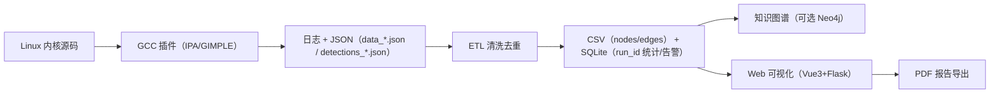
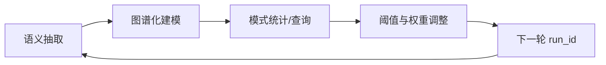

2025年（第18届）中国大学生计算机设计大赛

大数据实践赛作品报告

作品编号：

作品名称：Linux 内核安全静态分析与可视化治理平台

填写日期：2026-03-25

---

## 目 录

- 第1章 作品概述
- 第2章 问题分析
- 第3章 技术方案
- 第4章 系统实现
- 第5章 测试分析
- 第6章 作品总结
- 参考文献

---

## 第1章 作品概述

本作品面向“大数据实践”赛道，将 Linux 内核安全审计从“单次扫描工具”升级为“可治理的安全数据平台”。Linux 内核作为大数据集群与云计算平台的基础底座，一旦出现并发竞态、内存安全或权限漏洞，可能导致节点崩溃、数据泄露与权限绕过。传统静态扫描工具在面对内核“千万行级代码 + 构建链复杂 + 并发语义跨过程传播”的场景时，往往存在语义不准、误报多、结果难治理等问题。

本作品以 GCC 插件在编译期抽取 GIMPLE/IPA 语义为数据源，生产结构化安全数据（函数调用、全局变量读写、竞态告警、专项检测告警），并通过 `run_id` 机制与 SQLite 完成分析快照治理，再将关系数据导出为知识图谱（CSV/Neo4j）用于证据链查询与可视化，最终提供 Vue3+Flask 的 Web 控制台实现“上传—分析—可视化—报告导出”的闭环交付。

### 1.1 主题创意来源与产生背景

- **创意来源**：在内核安全审计中，开发者最缺的是“可解释、可回溯、可对比”的证据链；而大数据实践赛道更关注“数据全生命周期”的落地。我们将内核分析结果视为一种可治理的数据资产，引入 `run_id` 做版本化快照，并以知识图谱表达复杂关系，从而形成面向工程落地的“安全数据中台”。
- **产生背景**：内核构建系统（Kbuild）复杂，宏与编译选项多，外部工具难以稳定解析；GCC 插件可以无缝挂载到编译流程，天然适配内核工程，适合生产高信度语义数据。

### 1.2 用户群体

- Linux 内核/驱动开发与维护人员
- 大数据集群与云平台运维团队（节点基线安全审计）
- 安全研究与教学团队（复杂系统代码关系可视化）

### 1.3 主要功能与特色

- **编译期语义抽取（GCC Plugin）**：在 GIMPLE/IPA 层获取函数调用、全局变量读写、锁集状态等语义。
- **并发竞态告警（Lockset）**：检测无锁访问全局变量的读写风险，输出 `[RACE_WARNING]` 证据。
- **6 类专项检测器（模块化框架）**：
  - BufferOverflow / NullPointer / UseAfterFree / InfoLeak / PrivilegeEscalation / TOCTOU
- **数据治理（run_id + SQLite）**：运行记录、告警索引、统计摘要、TopN 热点自动汇总，支持历史回溯。
- **知识图谱（JSON→CSV→Neo4j）**：用 Function/GlobalVariable 与 CALLS/READS/WRITES 表达证据链。
- **Web 可视化与报告导出（Vue3+Flask）**：仪表盘、专项页面、图谱采样视图、PDF 报告导出。

### 1.4 应用价值与推广前景

- **工程价值**：将内核安全审计结果标准化、结构化、资产化，形成可复盘的数据闭环。
- **赛道价值**：符合大数据实践赛道对“数据生产—治理—挖掘—服务—交付”的全流程要求。
- **推广前景**：可扩展到其他基于 GCC 构建的 C/C++ 大型工程，并可接入 CI 形成持续安全治理。

---

## 第2章 问题分析

### 2.1 问题来源

Linux 内核代码规模巨大、模块耦合复杂，漏洞往往跨函数、跨文件传播。竞态问题尤为隐蔽：锁获取与释放可能分布在不同函数，单纯的文本扫描无法理解锁上下文。与此同时，内核构建链复杂，若工具不能融入构建过程，很难获取正确的宏展开与编译选项。

### 2.2 现有解决方案

- **文本/AST 级扫描（如 Cppcheck 等）**：部署方便，但在内核场景中往往存在语义不足、误报偏高的问题；且结果多为文本列表，治理能力弱。
- **商用静态分析平台（如 Coverity 等）**：能力强但闭源、成本高；对竞赛与二次开发不友好。
- **基于 LLVM/Clang 的分析**：生态丰富，但在部分场景需要替换/适配编译链，迁移成本高。

综合分析：内核场景更需要“原生融入构建链”的语义数据生产方式，以及对海量结果进行治理与可视化的能力。

### 2.3 本作品要解决的痛点问题

- **语义获取困难**：如何在不修改内核源码的前提下，获得可靠的过程间语义（调用、变量访问、锁上下文）。
- **数据量大、关系复杂**：如何表达与查询“调用链—变量访问—风险告警”的证据链。
- **结果难治理**：如何对多次运行产生的结果做版本化、可回溯、可对比的治理。
- **交付展示不足**：如何把复杂的分析结果用 Web 方式呈现，并形成可提交的报告产物。

### 2.4 解决问题的思路

#### 2.4.1 功能与性能需求

- **功能需求**：
  - 编译期抽取函数调用与全局变量读写
  - 竞态告警输出与聚合
  - 6 类专项检测器输出结构化告警
  - `run_id` 快照治理（历史、统计、TopN）
  - Web 可视化与 PDF 报告导出
- **性能/稳定性需求**：
  - 面向内核全量构建的大规模运行
  - OOM 风险控制：可配置并发数限制（`ANALYSIS_JOBS`）

#### 2.4.2 数据集说明（来源、格式、特点、规模）

- **数据来源**：Linux Kernel（例如 v6.6.1）在真实构建（`make`）过程中产生的编译期语义数据。
- **数据特点**：
  - 规模大：全量构建会产生 10w 级节点与 20w+ 级关系边（见第5章验证）。
  - 关系复杂：天然图结构（CALLS/READS/WRITES）。
  - 多形态：日志 + JSON + CSV + SQLite。

#### 2.4.3 数据样例

1）函数/关系数据（来自 `data_<pid>.json` 的抽象样例）：

```json
{
  "name": "vfs_read",
  "callees": ["rw_verify_area", "__vfs_read"],
  "global_reads": ["jiffies"],
  "global_writes": []
}
```

2）专项检测器告警（来自 `detections_<pid>.json` 的抽象样例）：

```json
{
  "type": "InfoLeakDetector",
  "severity": "HIGH",
  "message": "Possible sensitive data leak via printf",
  "file": "drivers/example.c",
  "line": 128,
  "column": 9,
  "suggestion": "Avoid logging secrets; mask or remove sensitive fields."
}
```

---

## 第3章 技术方案

### 3.1 总体技术路线

本作品采用“编译期语义抽取 → 数据治理快照 → 图谱建模挖掘 → Web 服务化交付”的技术路线。



图 1  技术路线框架图

### 3.2 核心技术方案分解

#### 3.2.1 编译期语义抽取（GCC Plugin）

- **原理**：在 GCC 的过程间分析（IPA）阶段注册 pass，遍历函数与 GIMPLE 语句，抽取调用关系、全局变量读写与锁相关语义。
- **优势**：不需要修改内核源码、不需要替换构建链，可直接适配 Kbuild 的复杂编译参数。

#### 3.2.2 并发竞态检测（Lockset）

- **原理**：维护 lockset（已持有锁集合）；当发现全局变量读/写且 lockset 为空时输出竞态告警。
- **输出**：以 `[RACE_WARNING]` 形式进入日志流，后续可被聚合、去重与可视化。

#### 3.2.3 模块化检测器框架（6 类专项）

- **原理**：抽象统一的 `DetectorBase` 接口与 `DetectorManager` 调度框架，将专项检测以模块形式接入，输出结构化告警 JSON。
- **覆盖范围**：内存安全（3）、信息泄露（1）、权限提升（1）、TOCTOU（1）。

#### 3.2.4 数据治理与快照（run_id + SQLite）

- **原理**：以 `run_id` 标识一次分析快照，在 SQLite 中记录运行元信息、告警索引、统计摘要与 TopN。
- **价值**：支持历史回溯、对比分析与可视化快速查询，体现大数据实践的“治理能力”。

#### 3.2.5 知识图谱建模（CSV/Neo4j）

- **原理**：将 `data_*.json` 清洗去重后导出 `nodes.csv/edges.csv`，用 Function/GlobalVariable 与 CALLS/READS/WRITES 形成属性图；可选导入 Neo4j 进行 Cypher 查询。
- **价值**：将“风险点”提升为“证据链可达性问题”，便于审计与解释。

#### 3.2.6 Web 服务化交付与报告导出

- **原理**：Flask 提供上传、调度、统计、告警与报告接口；Vue3 构建仪表盘与专项页面，形成可交互展示。
- **产物**：可导出 PDF 报告（后端生成 + 前端兜底）。

---

## 第4章 系统实现

### 4.1 软件结构与模块划分

- **GCC 插件**：`src/plugin/`
  - `analyzer_plugin.cpp`：插件入口与核心分析逻辑
  - `detectors/`：检测器框架与具体检测器实现
- **ETL 工具**：`tools/export_to_neo4j.py`（JSON→CSV）
- **脚本编排**：`scripts/`（启动、全流程、仅分析）
- **Web 控制台**：`web_dashboard/`
  - `backend/app.py`：Flask 后端（run_id、SQLite、API、任务调度）
  - `frontend/`：Vue3 前端（仪表盘与专项页面）

### 4.2 数据来源与产物落地（工程口径）

- **插件输出（按编译进程 pid 分片）**：
  - `data_<pid>.json`：函数调用与变量访问
  - `detections_<pid>.json`：检测器告警（结构化）
- **日志输出**：
  - `analysis_<target>.log`：完整编译/分析日志
  - `ast_<target>.log`：AST/GIMPLE 结构日志
  - `race_warnings_<target>.txt`：从日志中提取的竞态告警
- **图谱数据**：
  - `nodes.csv` / `edges.csv`
- **治理数据**：
  - SQLite：运行记录、告警索引、统计摘要（以 `run_id` 为主键）

### 4.3 数据训练（贴合实现的“训练”定义与工程实现）

> 模板要求必须描述“数据训练”。本作品采用“知识图谱驱动的模式学习 + 参数调优 + 反馈迭代”，而非神经网络训练。

#### 4.3.1 训练数据准备

- 从内核全量构建得到结构化语义数据（JSON/日志），再 ETL 成图谱（CSV/Neo4j）与治理库（SQLite）。

#### 4.3.2 训练过程（模式学习/调参/反馈）

- **模式学习**：将风险模式表达为可解释的子图特征（如：某全局变量被多个函数写入，且路径缺少锁语义；或敏感字段流向日志输出）。
- **参数调优**：基于 `run_id` 多轮运行反馈调整：
  - 扫描深度（K-hop）
  - 告警去重/合并策略
  - 严重度阈值与优先级权重



图 2  数据训练与迭代闭环

#### 4.3.3 训练输出

- “规则/模式库”：敏感模式词典、特权调用列表、告警阈值策略。
- “数据资产”：按 `run_id` 固化的 JSON/CSV/SQLite，支持复盘与对比。

### 4.4 改进过程与技术增量（工作量体现）

本作品在原型基础上完成了明显的工程增量：

- **检测能力增量**：从单一竞态检测扩展为“竞态 + 6 类专项检测器”。
- **架构增量**：引入 `DetectorBase/DetectorManager` 模块化框架，统一输出结构。
- **交付增量**：从脚本输出升级为 Web 控制台（上传、调度、历史、可视化、报告导出）。
- **治理增量**：引入 `run_id` 与 SQLite，将结果资产化与可追溯。

### 4.5 部署方法与运行方式

- **Web 演示**：
  - 后端：`scripts/start_backend.sh`
  - 前端：`scripts/start_frontend.sh`
  - 一键启动：`scripts/start_all.sh`
- **命令行模式**：
  - 全流程：`scripts/full_run.sh`
  - 仅分析：`scripts/run_analysis.sh`

### 4.6 工程难点与解决方法

- **难点 1：内核构建链复杂、外部工具难接入**
  - 解决：采用 GCC 插件挂载 Kbuild，直接在编译过程中抽取语义。
- **难点 2：大规模构建容易 OOM**
  - 解决：引入 `ANALYSIS_JOBS` 并发控制，Web 端更保守设置以保证稳态。
- **难点 3：结果海量且重复**
  - 解决：日志提取与告警去重，统计汇总写入 SQLite，前端按需分页/筛选。

---

## 第5章 测试分析

### 5.1 数据来源与规模验证

- **测试数据来源**：Linux Kernel v6.6.1 全量构建产生的语义数据。
- **规模验证指标**：节点数、边数、告警数、TopN 热点。

在一次集成测试中，系统可产生大规模图数据（示例）：

- 节点数：> 80,000
- 边数：> 200,000

上述规模通过图谱导出/导入后的计数得到，用于证明本作品具备处理内核级图数据的能力。

### 5.2 功能测试

#### 5.2.1 单元测试

- 使用小规模 C 测试文件验证：
  - 识别全局变量读写
  - 输出竞态告警 `[RACE_WARNING]`
  - 触发专项检测器样例（如 InfoLeak/Privilege/TOCTOU/UAF 等）

#### 5.2.2 集成测试

- 在 v6.6.1 全量构建中验证：
  - 插件可被稳定加载并输出日志/JSON
  - 图谱 CSV 可生成
  - Web 端可加载统计与告警，并展示仪表盘与专项页面
  - PDF 报告可导出

### 5.3 稳定性与资源控制测试

- **并发控制**：通过 `ANALYSIS_JOBS` 限制构建并发，避免内存不足导致任务失败。
- **结果去重**：针对编译单元重复输出的告警进行聚合/去重，避免统计膨胀。

### 5.4 对比分析（定性对比）

考虑到内核构建链与语义复杂性，本作品相较于“文本/AST 级扫描”具备以下优势：

- **语义层级**：GCC GIMPLE/IPA 语义 > 纯文本/AST
- **构建链兼容**：原生融入 Kbuild，无需替换编译链
- **数据治理**：具备 `run_id` 快照与 SQLite 索引，支持复盘与对比
- **交付能力**：Web 可视化与 PDF 导出满足大赛“可展示、可交付”要求

---

## 第6章 作品总结

### 6.1 作品特色与创新点

- **编译期语义数据工厂**：基于 GCC 插件获取高信度语义数据，适配内核构建。
- **数据治理快照（run_id）**：将分析结果资产化，支持历史回溯与对比。
- **知识图谱证据链**：用图结构表达复杂关系，支持路径查询与解释。
- **模块化检测框架**：6 类专项检测器统一接口，便于扩展。
- **Web 闭环交付**：上传、调度、可视化、报告导出一体化。

### 6.2 应用推广

- 集成到内核/驱动开发流程进行提交前审计
- 作为大数据集群节点基线检查的内核安全审计模块
- 教学科研中用于复杂系统代码关系可视化与安全分析案例演示

### 6.3 作品展望

- 在保持可解释性的前提下增强数据流/别名分析，降低误报
- 引入图算法或图表示学习用于风险优先级排序（增强模块）
- 丰富报告模板与案例库，提升展示完整度与可交付性

---

## 参考文献

[1] GCC Internals Documentation（GCC Plugin / GIMPLE / IPA Pass）.

[2] Neo4j Documentation（Property Graph Model, Cypher Query Language）.

[3] R. S. Sandhu, E. J. Coyne, H. L. Feinstein, C. E. Youman. Role-Based Access Control Models. IEEE Computer, 1996.

[4] S. Savage, M. Burrows, G. Nelson, P. Sobalvarro, T. Anderson. Eraser: A Dynamic Data Race Detector for Multi-threaded Programs. SOSP, 1997.

[5] Linux Kernel Documentation（Kbuild, Concurrency primitives, spin_lock/spin_unlock）.
