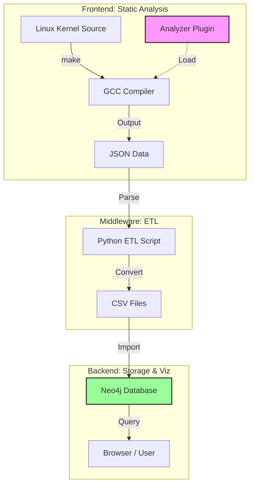
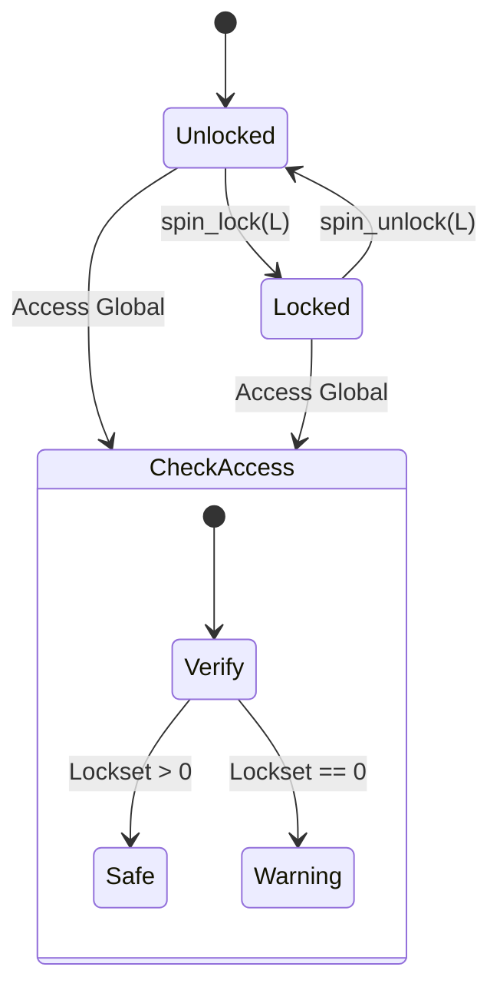
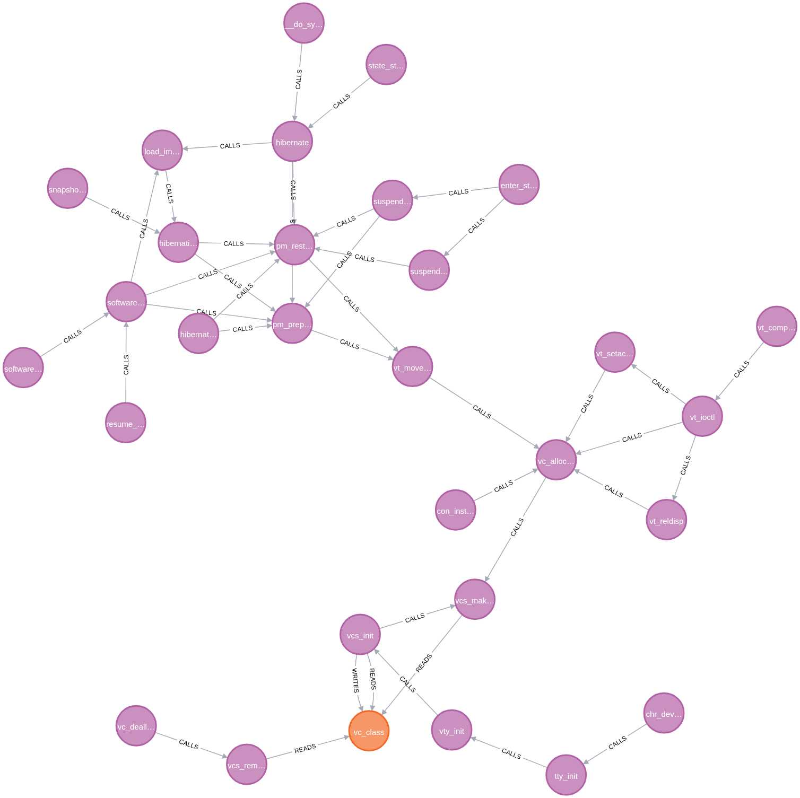

# Linux 内核高精度静态分析与图谱化审计系统

## 基于 GCC 插件与 Neo4j 的并发安全检测方案

### “不知道”队 | 汇报人: Jacob

---

# 🚀 核心亮点

- **首次实现图谱化审计**: 
  - 将数千万行 Linux 内核代码转化为**可交互的知识图谱**。
  - 让复杂的函数调用链“看得见、摸得着”。

- **工业级全量分析能力 (Industrial Scalability)**:
  - **全景覆盖**: 成功处理 **Linux v6.6.1** 全量构建，覆盖 **3000万+** 行源码。
  - **海量图谱**: 构建并输出 **860,502** 个高精度语义节点。
  - **性能卓越**: 分析作为编译副产物，无明显构建延迟。

- **零侵入式 (Zero-intrusion) 架构**:
  - 直接挂载于现有 GCC 编译管线。
  - 无需修改任何内核源码。

---

# 🔍 行业现状与痛点

### 现有社区工具的局限

- **Sparse / Smatch (静态)**:
  - 输出为海量线性文本日志。
  - 难以理清跨越 10+ 层的复杂调用链。
  
- **KCSAN (动态)**:
  - 依赖运行时覆盖率 (Runtime Coverage)。
  - **无法检测**未被执行的冷门代码路径 (Cold paths)。

---

# ⚔️ 方案对比

| 维度 | Sparse/Smatch (社区主流) | KCSAN (运行时检测) | **本方案** |
| :--- | :--- | :--- | :--- |
| **分析视角** | 线性文本 / AST | 运行时指令流 | **全景知识图谱 (Graph)** |
| **覆盖范围** | 全局 | 仅限运行路径 | **全局 (含未执行分支)** |
| **可视化** | 无 (纯文本) | 无 (dmesg 报错) | **Neo4j 交互式查询** |
| **集成难度** | 需独立解析器 | 需内核配置支持 | **原生 GCC 插件集成** |

---

# ⚙️ 核心技术实现

- **纯 GIMPLE 语义分析 (GIMPLE Alone)**:
  - **架构无关**: 摒弃指令集 (ISA) 依赖，实现 x86/ARM/RISC-V **跨架构通用**。
  - **高保真**: 完整保留变量类型与控制流信息，精度远超汇编级分析。

- **算法设计**:
  - `analyzer_plugin.cpp`: **过程间分析 (IPA)** + **锁集状态机**。
  - `export_to_neo4j.py`: **图谱清洗** (Deduplication & Entity Mapping)。

- **分析对象 (Linux v6.6.1)**:
  - **3000 万+** 行代码，数万个编译单元。

- **产出数据**:
  - **860,000+** 分析节点 (函数、变量、锁)
  - 核心内核模块完整调用图

---

# 🏗 系统架构

---

# 🔧 技术细节: GIMPLE 与变量消歧

- **为何选择 GIMPLE?**
  - 标准化中间表示，比原始 AST 更易处理。
  - 保留了高层语义 (类型、函数调用)。

- **解决 Shadowing (变量遮蔽) 问题**:
  - 利用 `TREE_STATIC` 属性精准区分 **全局变量** 与同名局部变量。
  - 消除传统文本分析工具 (如 `grep`) 的常见误报。

---

# 🔐 技术细节: 锁集分析算法

- **状态机模型**:
  - `HeldLocks` 集合追踪。
  - `spin_lock` / `unlock` 状态变迁。

- **竞态检测**:
  - **若** 访问全局变量 `G`
  - **且** `HeldLocks` 为空
  - $\rightarrow$ ⚠️ **[RACE_WARNING]**

---

# 🕸 可视化效果

- **调用链可视化**:
  - `Func A` $\rightarrow$ `Func B` $\rightarrow$ `Var`
  - 清晰展示依赖路径。

- **审计效率**:
  - 🔴 **红色**: 无锁 (危险)
  - 🟢 **绿色**: 持锁 (安全)
  - **秒级**定位竞态风险。

---

# 🎯 总结

- **总结**:
  - 将代码审计从“逐行阅读”提升至“图谱拓扑”维度。
  - 以极低的代码成本构建了覆盖 3000 万行代码的分析系统。

- **未来展望**:
  - 引入 **指针分析 (Points-to Analysis)** 解决别名问题。
  - 支持读写锁 (`rwlock`) 和 RCU 原语。

---
